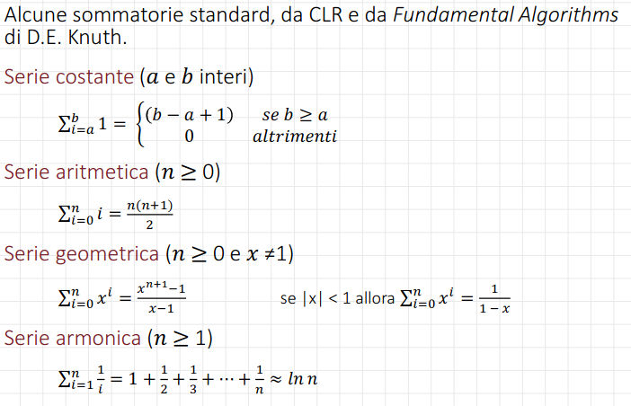
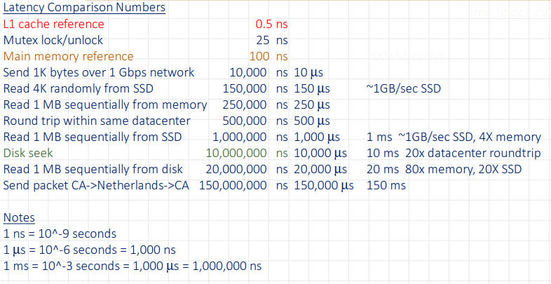

# Algoritmi
Un ==algoritmo e' un modo per risolvere un problema==; dato un problema, una sua risoluzione e' un processo che trasforma i dati in ingresso nei corrispondenti dati finali.
### Proprieta' degli algoritmi
- ==Input== da un insieme ben specificato (stringhe, numeri...)
- ==Output== da un insieme ben specificato
- ==Non ambiguita'== di ogni passo di elaborazione
- ==Eseguibilita'== di ogni istruzione in tempo finito
- ==Correttezza== del risultato per ogni possibile input
- ==Finitezza== del numero di passi di elaborazione
- ==Efficacia== di ongi passo di elaborazione
- ==Generalita'== per una classe di problemi

Ogni problema puo' essere risolto in molti modi diversi -> ==Molti algoritmi== di soluzione per uno stesso problema. Quale conviene usare? Necessario:
1. Saperli rappresentare -> ==Pseudocodice==
2. Saperli confrontare -> ==Notazione O grande==

### Pseudocodice
Un algoritmo e' espresso come ==sequenza di azioni elementari== (passi) da eseguire per risolvere il problema. I passi vengono rappresentati con un ==linguaggio astratto ed informale==: lo ==**pseudocodice**==.
Lo pseudocodice utilizza la ==struttura di un linguaggio di programmazione== normale, ma e' ==inteso per uso umano== e non di una macchina: omette dettagli essenziali (dichiarazioni di variabili, subroutine, ecc.).
Il linguaggio e' inoltre ==aumentato con passi di linguaggio naturale==, o con notazioni matematiche compatte.
Non esiste ==nessuno standard== per la sintassi dello pseudocodice, ognuno puo' scriverlo come vuole. **Gli array hanno ==indici a partire da 1==**.

### Sommatorie


### Confronto tra algoritmi
Cosa rende un programma migliore di un altro?
==Molti criteri possibili== legibilita' del codice, paradigmi di sviluppo, efficienza...
==Non interessano== gli aspetti che derivano dal linguaggio, dalla piattaforma o dall'implementazione.
==Interessana== il metodo: l'algoritmo e l'utilizzo di risorse che implica.
==Le risorse== possono essere diverse: tempo di esecuzione, memoria richiesta, numero di CPU, banda passante per la comunicazione, energia elettrica consumata...
==**Due risorse principali: tempo e spazio**==, spesso in trade-off. A seconda della situazione, si puo' voler peggiorare una per migliorare l'altra.
#### Fattori di tempo della CPU
Dimensione dell'input -> crescita lineare tempo di lettura
Tempo di elaborazione -> dipende dall'algoritmo
Velocita' di accesso alla memoria -> varia di un fattore
Velocita' CPU -> varia di un fattore
Numero di processori -> varia di un fattore
Ottimizzazione del compilatore/linker -> ~20%
### Latenza di lettura in base alla memoria


### Passi e dimensioni di un algoritmo
Un algoritmo e' una sequenza di passaggi necessari per risolvere un problema: il ==tempo di esecuzione di un algoritmo puo' essere espresso come il numero di passi== necessari per risolvere il problema. Questra astrazione caratterizza l'efficienza di un algoritmo pur rimanendo ==indipendente da computer o programma==. Prendiamo un algoritmo *p* i cui pasis piu' costosi sono le ==assegnazioni di variabili==. Contandole si ha un'approssimazione del tempo di esecuzione: tre istruzioni di assegnazione (min, max, m) che vengono eseguite solo una volta, e un ciclo che esegue un assegnamento $n-1$ volte. Possiamo denotare questo con funzione $T$, dove $T(n) = 3 + n - 1$.
==Il parametro **n**== e' definito coe la "==dimensione del problema==", cosi' possiamo leggere la funzione come $T(n)$ e' il tempo necessario per risolvere un problema di dimensione n".

### O grande
La dimensione del problema per *p* e' il numero di interi in input: una istanza con 100.000 interi e' piu' grande di una con 1000. E' ovvio che ==il tempo di esecuzione cresce con la dimensione dell'istanza:== Quanto?
==Non interessa il numero esatto di istruzioni==, si considera solo il termine dominante. Cosi' si ottiene una approssimazine di T(n).
L'==**oridne di grandezza**== di T(n) dipende solo dal termine che cresce di piu' al crescere di n. ==Ordine di grandezza viene ridotto in O grande==.
Si scrive _**O(f(n))**_, dove _**f(n)**_ e' il termine dominante dell'originale _**T(n)**_. Questa e' la "notazione O grande", una approssimazione del numero di passaggi in un calcolo.
Come esempio, supponiamo: $T(n) = 5n^3 + 27n^2 + 10000$
Con _**n**_ piccolo (<4) la costante 10000 e' dominante e $x^2 > x^3$
Col crescere di _**n**_, $x^3$ diventa molto piu' grande degli altri termini. Per approssimare $T(n)$ per $n$ grandi, si puo' tenere $5x^3$ e ignorare gli altri termini. Anche il coefficiente $5$ diventa non significativo per $n$ grandi. La funzine $T(n)$ ha un ordine di grandezza $f(n) = n^3$  : $T(n)$ e' $O(n^3)$.

### Complessita'
Un algoritmo $O(n^3)$ non puo' essere usato per istanze molto grandi, mentre un algoritmo $O(n)$ e' utilizzabile. Quello che interessa e' il ==tasso di crescita== delle funzioni di complessita'. La funzione di crescita della complessita' in spazio e tempo, al crescere della dimensione dell'istanza $n$ e' una misura utilizzabile come base per il confronto di algoritmi.

#### Crescita delle funzioni
La crescita delle funzioni puo' essere descritta con la notazione ==O grande==.
==Definizione==: Siano $f$ e $g$ due funzioni $R$ -> $R$. ==Diciamo che $f(x)$ e' $O(g(x))$ se esistono due costanti $C$ e $k$ tali per cui $$ f(x) <= C * g(x)$$ quando $x > k$==

Quando si analizza la crescita di ==funzioni di complessita'==, $f(x)$ e $g(x)$ si assumono sempre positive.
Quando si vuole dimostrare che $f(x)$ e' $O(g(x))$, e' sufficiente trovare una coppia $(C, k)$ per cui vale la relazione (ce ne possono essere infinite).

L'idea della notazione O grande e' definire un ==limite superiore== alla crescita della funzione $f(x)$ per $x$ grandi.
Questo limite e' specificato dalla funzione $g(x)$, che e' scelta ==molto piu' semplice di== $f(x)$.
E' possibile utilizzare la costante $C$ in $f(x) \le C * g(x)$ quando $x > k$, perche' $C$ ==non cresce con== $x$.
Interesano solo $x$ grandi, quindi non importa se $f(x) > C * g(x)$ per $x <= k$.

Esempio:
Dimostrare che $f(x) = x^2 + 2x + 1$ e' $O(x^2)$.
Per $x > 1$ abbiamo: $$x^2 + 2x + 2 \le x^2 + 2x^2 + x^2 \Rightarrow x^2 + 2x + 1 \le 4x^2$$
Quindi, per $C = 4$ e $k = 1$ : $f(x) \le Cx^2$ quando $x > k$.
$\Rightarrow f(x)$ e' $O(x^2)$.

Se $f(x)$ e' $O(x^2)$, e' anche $O(x^3)$?
Si, $x^3$ cresce piu' di $x^2$, quindi $x^3$ cresce anche piu' di $f(x)$.
Dobbiamo sempre trovare la **piu' piccola** funzione semplice $g(x)$ per cui $f(x)$ e' $O(g(x))$.

### Caso ottimo, medio, pessimo
Spesso il ==tempo di esecuzione dipende dai valori letti in input==, non dalla dimensione dell'inpt (ordinamenti, knapsack). Istanze uguali possono avere tempi di esecuzione molto diversi.
Per questi algoritmi dobbiamo definire una caratterizzazione del _caso pessimo, caso ottimo e caso medio._
- ==Il caso pessimo== lo si ha per input che rendono massimo il tempo di esecuzione.
- ==Il caso ottimo== lo si ha per input che rendono minimo il tempo di esecuzione.
- ==Il caso medio== lo si ha con riferimento all'intero universo di input possibili, lo si puo' indentificare con metodi statistici, spesso complessi.

##### Esempio: ricerca sequenziale
Restitiusce ==l'indice== della prima occorrenza del valore `val` nell'array `v[]`. Ritorna `-1` se il valore non e' presente.
```
procedure RicSequenziale (val, v[])
	for (i = 1 ... v.length)
		if (v[i] == val) then return i
	return -1
```
Nel ==caso ottimo== l'elemento e' allinizio della lista, e viene trovato alla prima iterazione. Quindi $Tbest(n) = O(1)$
Nel ==caso pessimo== l'elemento non e' presente nella lista (oppure e' presente nell'ultima posizione), quindi si itera su tutti gli elementi. Quindi $Tworst(n) = \Theta (n)$
Nel ==caso medio==:
Media su tutti i possibili casi -> ==Analisi statistica==.
Non abbiamo informazioni sulla probabilita' con cui si presentato i valori nella lista, dobbiamo fare delle ==ipotesi semplificative==:
- Assumiamo che l'elemento sia sempre presente
- Assumiamo che la probabilita' $p_i$ che l'elemento cercato si trovi in posizione $i (i = 1, 2, \ldots, n)$ sia $p_i = \frac 1n$ per ogni $i$.
Il tempo $T(i)$ necessario per individuare l'elemento nella posizione i-esima e' $T(i) = i$. Quindi possiamo concludere che:
$$T_{avg}(n) = \sum_{i=1}^n p_iT(i) = \frac1n\sum_{i=1}^n i = \frac1n \frac{n(n+1)}{2} = \Theta(n)$$

### Funzioni di riferimento
In ordine di grandezza crescente:
- $1$ Costante $\rightarrow O(1)$ ==tempo costante==: dato un input di dimensione n, serve sempre un numero fisso di passi per risolvere il problema.
- $log(n)$ Logaritmica $\rightarrow O(log(n))$ ==tempo logaritmico==: dato un input di dimensione n, il numero di dati da considerare per risolvere il problema cala di un fattore ad ogni passo (es. si dimezza ad ogni passo).
- $n$ Lineare $\rightarrow O(n)$ ==tempo lineare==: dato un input di dimensione n, il numero di passi richesti e' proporzionale al numero di dati (es. ciclo for).
- $nlog(n)$ Logaritmica lineare
- $n^2$ Quadratica $\rightarrow O(n^2)$ ==tempo quadratico==: dato un input di dimensione n, il numero di passi cresce col quadrato di n (es. due for annidati).
- $n^3$ Cubica
- $2^n$ Esponenziale $\rightarrow O(C^n)$ ==tempo esponenziale==: dato un input di dimensione n, il numero di dati da considerare per risolvere il problema cresce di un fattore ad ogni passo (es, si raddoppia ad ogni passo). Tipico di situazioni in cui si deve considerare _ogni combinazione o permutazione_.

Un problema che puo' essere risolto con complessita' polinomiale nel caso pessimo e' detto ==trattabile==. Problemi con complessita' maggiore sono detti ==intrattabili==. Problemi per cu non si conosce nessun algoritmo di soluzione sono detti ==insolubili==.

### $\Omega$ grande
Limite inferiore asintotico, diciamo che $f(n)$ e' omega grande di $g(n)$:
$f(n) = \Omega(g(n))$
Se esistono due costanti $c$ e $n_0$ t.c. $cg(n) \le f(n)$ per $n \ge n_0$
Usato per:
- tempo di esecuzioe nel caso ottimo
- limiti inferiori di complessita'

Sia $f(n) = n^3 + 2n^2$ e $g(n) = n^2$, dimostriamo che $f(n) = \Omega(g(n))$.
Dobbiamo trovare due costanti $c > 0, n_0 \ge 0$ tali che per ogni $n \ge n_0 \Rightarrow f(n) \ge cg(n)$, ossia: $n^3 + 2n^2 \ge cn^2$(\*) da cui otteniamo:
$$c \le \frac{n^3+2n^2}{n^2} = n + 2$$
Se ad esempio scegliamo  $n_0=0$ e $c=1$, si ha che la relazione (\*) e' verificata.

### $\Theta$ grande
Approssimazione stretta. $f(n) = \Theta(g(n))$ se esistono $c_1, c_2, n_0$ t.c. $c_1g(n) \le f(n) \le c_2g(n)$ per $n \le n_0$
$f(n)=\Theta(g(n)) \iff f(n)=O(g(n)) \land f(n)=\Omega(g(n))$ 

### o piccolo e $\omega$ piccolo
$f(n) = o(g(n))$ analogo stretto di O grande:
Per ogni $c$, esiste $n_0$, t.c. $f(n) < cg(n)$ per $n \le n_0$
Usato per confrontare tempi di esecuzione. Se $f(n) = o(g(n))$ diciamo che $g(n)$ domina $f(n)$.
$f(n) = \omega(g(n))$ analogo stretto di $\Omega$ grande.

### Limiti e notazione asintotica
$\lim \limits_{x\to\infty} \frac{f(n)}{g(n)} \to c \Rightarrow f(n) = \Theta(g(n))$
$\lim \limits_{x\to\infty} \frac{f(n)}{g(n)} \to 0 \Rightarrow f(n) = o(g(n))$
$\lim \limits_{x\to\infty} \frac{f(n)}{g(n)} \to \infty \Rightarrow f(n) = \omega(g(n))$
---
## Analisi asintotica
Obiettivo:
- ==semplificare== l'analisi del consumo di risorse di un algoritmo prescindendo dai dettagli implementativi o di altro genere.
- ==classificare== gli algoritmi in base al loro comportamento asintotico.
**_Astrazione_**: come il tempo di esecuzione cresce in funzione della taglia dell'input _asintoticamente_.
Asintoticamente implia **non per tutti gli input**. Ad esempio non per input di piccole dimensioni.
#### Costo di esecuzione
Un algoritmo $A$ ha un costo di esecuzione $O(f(n))$
- rispetto ad una certa risorsa di calcolo
- su istanze di ingresso di dimenzione $n$
se la quantita' $r(n)$ di risorsa sufficiente per eseguire $A$ su una qualunque instanza di dimensione $n$ verifica la relazione $r(n)=O(f(n))$.
Le risorse di calcolo di interesse sono soprattutto _tempo di calcolo e occupazione di memora._