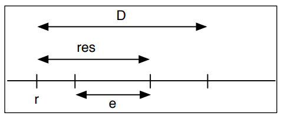

# System-on-a-Chip

Chips for embedded systems featuring a CPU architecture and enough memory to host an OS, typically a Real-Time OS.

## SoC and Single-Board CPU

SoC = System-on-a-Chip, an integrated circuit (chip) that integrates all or most components of a computer or other electronic system

A SoC integrates:
- one or multiple processors/cores
- a memory module containing one or multiple blocks of different types: ROM, RAM, EEPROM, FLASH
- a clock, timers
- connectors for standard interfaces, such as USB, Ethernet, USART, I2C, SPI
- radio/network interfaces

## ESP 8266

SoC designed for IoT
Hardware:
- Processor: L106 32-bit RISC microprocessor core 80 MHz
- 64 KiB of instruction RAM, 96 KiB of data RAM
- 16 GPIO pins
	- SPI, I2C, I2S + UART
	- 10-bit ADC
- IEEE 802.11 b/g/n Wi-Fi

Various SDKs and firmwares
- GCC toolchain, Wiring/Arduino, NodeMCU Lua-based, MicroPython, ESP-Open-RTOS Open source FreeRTOS-based

## ESP32

ESP32 si a series of low-cost, low-power system on a chip microcontrollers with integrated Wi-Fi and dual-mode Bluetooth.
Hardware:
- CPU: Xtensa dual-core 32-bit LX6 microprocessor, operating at 160 or 240 MHz + Ultra low power (ULP) co-processor
- Memory: 320 KiB RAM, 448 KiB ROM
- Wireless connectivity: Wi-Fi 802.11 b/g/n + Bluetooth v4.2 BR/EDR and BLE (shares the radio with Wi-Fi)

Peripheral interfaces:
- 34 programmable GPIOs, 12-bit SAR ADC up to 18 channels, $2\times$ 8-bit DACs
- 4 SPI, 2 I2S interfaces, 2 I2C interfaces
- 3 UART

## Real-time OS

Embedded systems based on SoC have enough resources (in terms of computational power and memory) to host a full-fledged operating system (OS).
Embedded and Real-Time OS (RTOS): operating systems designed to be used in embedded systems.

General features:
- compactness
- efficiency
- reliability
- determinism & predictability

Unlike desktop OS, they are typically designed to run **one** application at a time, the application is usually multi-task/multi-threaded

They must react and manage events and inputs within specified time intervals, and manage the execution of tasks/computations that have **deadlines**:
- **Hard** real-time: deadlines are correctness requirements, they must be satisfied (otherwise: failures)
- **Soft** real-time: deadlines should be respected in normal conditions, they can be violated in some cases and the violation is meant to be managed

### Determinism

**Determinism** is the most important aspect of real-time systems, in particular for hard real-time.
It means that the system should be **predictable**:
- the time needed to perform some task
- the maximum time required to execute some action or getting some input or from a sensor or to react to some interrupt
- the number of cycles required to execute an operation must always be the same

In these systems, the execution can be interrupted (by means of interrupts), however the overhead (interrupt latency, context switch, interrupt handler execution time) should be known.

## Processes, tasks and threads

Process (definition): a program in execution, has its own memory, can have multiple threads.
Thread: an independent thread of control or control flow, threads part of the same process share the process memory.
Multi-threading: concurrent execution of multiple threads often called **tasks** in RTOS. A way to split and application into modules, has the notion of priority.
Scheduling done by the kernel: to realise multi-tasking and multi-threading through various strategies and algorithms: pre-emptive vs. cooperative, round-robin + priority based.

### Tasks: Temporal Parameters

Temporal properties of tasks are defined by 4 fundamental parameters:

- **release time**: $r$
	the time point in which the task enters the ready queue, being ready to be executed
- **execution time**: $e$ (=WCET)
	maximum duration of the task
- **response time**: $\text{res}$
	interval time between release of the task and its completion
- **deadline**: $D$
	maximum time given to execute the task

Tasks can be:
- **periodic**: the task is released at a fixed temporal interval (period)
- **aperiodic**: the task is released at arbitrary times
- **sporadic** like periodic, but with hard deadlines

