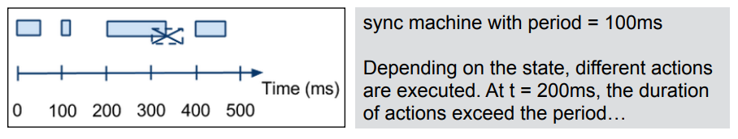

# 

Problem: complex embedded software modelling and design, need of proper approaches to decompose/modulate the behaviour and functionalities
Approach: Task-based Architectures
- The embedded software is decomposed into a set of **concurrent tasks**.
- Each task represents a specific well-defined confined unit of work/job to be done
- Each task can be described by a FSM
- The global behaviour is the result of the execution and interaction of the FSMs

## Task decomposition

### Advantages

**Modularity**:
- Every task is an independent module
- The "interface" of the module in this case is the set of input/output variables / objects that the task is using, these can be shared with other modules

Advantages:
- Reduced complexity for the single task when compared to the global behaviour
- Easier debugging
- Reusability

### Challenges

Tasks are **concurrent**
- Their execution overlaps in time
- Conceptually each task has its own logical control flow

Tasks may have dependencies that create interactions among tasks and that need to be properly managed
- Interaction and coordination mechanisms, typically based on shared variables/objects

### Shared variables and race conditions

Generally speaking, shared variables among concurrent tasks may lead to race conditions, in the case of concurrent reads/writes. In a cooperative case there could not be races:
- each task tick is executed by the scheduler in sequence
- the execution is atomic from the point of view of the whole system

However the execution of multiple ticks of a task can be interleaved with the ones of other tasks, this may lead to high-level races.

### Overrun Exception

**Overrun Exception** - when the execution time of actions exceeds the period.
- Called a *timer overrun* if the scheduler is times-based using interrupts (interrupt-driven schedulers). In this case a new interrupt is generated before the conclusion of the interrupt handler.

### Worst-case execution time

The **CPU utilisation parameter** is the percentage of time in which the CPU (microcontroller) is used to execute a task:
$$U=(\frac{\text{time used for a task}}{\text{total time}})\times100\%$$

The **Worst-Case-Execution-Time (WCET)** is the execution time for a task in the worst case scenario.
In the case of multiple states/transitions, we consider the longest sequence of instructions.
If tasks have the same period, then the WCET is computed by summing the individual WCETs of those tasks.

We compute $U$. If $U>100\%$, then an overrun exception may occur.
In that case, in order to solve/avoid the problem, we can:
- Increase the period of the FSM
- Optimise the sequence of instructions to reduce the WCET
- Break long sequences in smaller sequences of actions
- Use a faster MCU
- Remove functionalities/behaviours from the system