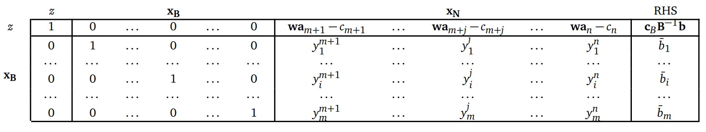

# Programmazione Lineare
## Problema Primale
### Trafromazione in forma standard
Dal problema primale in forma canonica:
$$
\begin{array}{ll}
	\text{min} & z=cx \\
	\text{s.t.} & Ax\ge b \\
	& x\ge0
\end{array}
$$
Otteniamo il problema primale in forma standard aggiungendo una variabile di _slack_ per trasformare i vincoli da disequazioni a equazioni:
$$
\begin{array}{ll}
	\text{min} & z = cx \\
	\text{s.t.} & Ax-Ix_s = b \\
	& x, x_s\ge0
\end{array}
$$
### Soluzioni base
Dato un problema primale in forma standard, la matrice $A$ puo' essere riscritta nella forma $A = [B, N]$ dove $B \in \mathbb{R}^{m,m}$ corrisponde a $m$ colonne linearmente indipendenti e $N \in \mathbb{R}^{m,n-m}$ sono le rimanenti $n-m$ colonne di $A$.
Ponendo $x^T=[x_B,x_N]$, il sistema dei vincoli puo' essere riscritto come:
$$
[B,N]=\left[\begin{array}{l}x_B\\x_N\end{array}\right]\rightarrow Bx_B+Nx_N=b
$$
e poiche' $B$ e' invertibile si ha: $x_B=B^{-1}b-B^{-1}Nx_N$
Se fissiamo $x_N=0$, la soluzione $x=[x_B,x_N]=[B^{-1},0]$ rappresenta una __soluzione base__. Nel caso in cui $x_B\ge0$ (i.e. soddisfa i vincoli di negativita') diremo che $x$ e' una ==soluzione base ammissibile==.
### Ottimizzazione della soluzione base
Il valore della funzione obiettivo corrispondente alla soluzione base $x=[x_B,x_N]=[B^{-1},0]$ e' dato dall'espressione:
$$
z=[c_B,c_N]\left[\begin{array}{l}x_B\\x_N\end{array}\right]= c_BB^{-1}b
$$
Per determinare come varia la funzione obiettivo per valori non nulli delle variabili non base $x_N$, dato che $x_B=B^{-1}b-B^{-1}Nx_N$ avremo:
$$
\begin{array}{l}
z=c_Bx_B+c_Nx_N=\\=c_B(B^{-1}b-B^{-1}Nx_N)+c_Nx_N=\\=c_BB^{-1}b-(c_BB^{-1}N-c_N)x_N
\end{array}
$$
Se definiamo $w=c_BB^{-1}$ possiamo scrivere:
$$
z=wb-(wN-c_N)x_N=wb-\sum_{k\in \mathbb{N}}(wa_k-c_k)x_k
$$
dove $\mathbb{N}$ e' l'insieme degli indici delle variabili/colonne non base.
Se $(wN-c_N)\le0$ la soluzione base ammissibile $x$ e' ottima. Nel caso, invece, esistesse una colonna $k$ non base tale che: $wa_k-c_k <0$ allora il valore della funzione obiettivo puo' decrescere dal valore attuale $z_0=c_BB^{-1}b=wb$ al valore: $z=z_0-(wa_k-c_k)x_k$
Il miglioramento della funzione obiettivo dipende dal valore massimo che la variabile $x_k$ puo' assumere, garantendo che la nuova soluzione sia sempre base ammissibile.
Per determinare quanto possiamo aumentare la variabile $x_k$ dobbiamo considerare l'equazione che determina la soluzione $x_B$ in funzione di $x_N$: $x_B=B^{-1}b-B^{-1}Nx_N$ che possiamo riscrivere come:
$$
x_B=\bar{b}-y^kx_k
$$
dove $\bar{b}=B^{-1}b$ e $y^k=B^{-1}a_k$ (ipotizzando che $x_j=0,\forall j\in \mathbb{N}\setminus\{k\}$)
Per ogni componente i-esima di $x_B, i=1,...,m$ abbiamo che: $x_i=\bar{b}-y^kx_k$
Se vogliamo che la soluzione base rimanga ammissibile dobbiamo aumentare $x_k$ in modo che $x_i=\bar{b_i}-y^kx_k \ge 0$
Quindi per ogni ogni $i$ la variabile $x_k$ deve rispettare la condizione: $x_k\le\frac{\bar{b_i}}{y^k_i}$
Il valore **massimo** che la variabile $x_k$ puo' assumere e' dato dal cosiddetto ==Rapporto di Minimo==:
$$
x_k=\frac{\bar{b_r}}{y^k_i}=min_{i=1,..,m}\left[\frac{\bar{b_i}}{y^k_i}:y^k_i>0\right]
$$
Nel caso in cui $y^k \le 0$ la funzione obiettivo e' illimitata, in quanto $(wa_k-c_K)>0$ e $x_k$ puo' arbitrariamente crescere garantendo l'ammissibilita' della soluzione.
Una volta aggiornato il valore della variabile $x_k$ tutte le variabili $x_i$ in base sono aggiornate come segue:
$$
x_i=\bar{b_i}-y^k_i\frac{\bar{b_r}}{y^k_r}
$$
mentre tutte le altre variabili non base diverse da $k$ rimangono nulle.
La variabile $x_r$ dopo essere stata aggiornata sara' nulla e la colonna $a_k$ sostituisce la colonna $a_r$ nella base $B$. Diciamo che $x_k$ entra in base, mentre $x_r$ esce dalla base.

## Algoritmo del Simplesso Primale
1. **Inizializzazione**: Definisce una soluzione base ammissibile: $x=[x_B,x_N]=[B^{-1}b,0]=[\bar{b},0]$ di costo $c_Bx_B=c_BB^{-1}b$
2. **Pricing**: Calcola $w=c_BB^{-1}$ che equivalea risolvere $wB=c_B$. Calcola i costi ridotti $wa_j-c_j$ per le variabili non-base $j\in \mathbb{N}$ e determina $wa_k-c_k=max_{j\in\mathbb{N}}\{wa_j-c_j\}$
3. **Condizioni di ottimalita'**: se $wa_k-c_k < 0$ allora la soluzione e' ottima
4. **La variabile $k$ e' candidata a entrare in base**: Calcola $y^k=B^{-1}a_k$ che equivale a risolvere $By^k=a_k$. Se $y^k\le0$ allora la soluzione e' illimitata.
5. **Rapporto minimo**: Calcola il valore da assegnare a $x_k$: $x_k=\frac{\bar{b_r}}{y^k_r}=min\{\frac{\bar{b_i}}{y^k_i}:y^k_i>0,i=1,..,m\}$ La variabile $x_r$ esce dalla base e $x_k$ entra al suo posto. Aggiorna $B,N$ e la soluzione base $x=[x_B,x_N]=[\bar{b},0]$. Ritorna allo step 2.
## Problema Duale
Si consideri il problema primale in forma canonica:
$$
\begin{array}{ll}
	z_P=\text{min} & cx \\
	\text{s.t.} & Ax\ge b \\
	& x\ge0
\end{array}
$$
Il cui insieme dei punti ammissibili e' $X=\{x:Ax\ge b,x\ge0\}$
Il suo problema duale e' il seguente:
$$
\begin{array}{ll}
	z_D=\text{max} & wb \\
	\text{s.t.} & wA\le c \\
	& w\ge0
\end{array}
$$
Il cui insieme dei punti ammissibili e' $W=\{w:wA\le c,w\ge0\}$
### Come ottenere il duale
Partendo dal problema primale in forma **standard**:
$$
\begin{array}{ll}
	x_P=\text{min}  & cx \\
	\text{s.t.}& Ax-Ix_s = b \\
	&x,x_s\ge0
\end{array}
$$
Dove $I=[a_{n+1},..,a_{n+m}]=[e_1,\dots,e_m]$ e' la matrice identita' di ordine m, questo perche' le variabili di **slack** del problema appaiono nelle equazioni dei vincoli come con coefficente $-1$ se le disequazioni de vincoli nella forma canonica del problema avevano segno $\ge$. (Quindi per ottenere il duale dobbiamo prima riportare tutti i vincoli nella forma canonica al segno $\ge$ e trasformare il problema nella sua forma standard.)
In corrispondenza di una soluzione ottima del primale deve esistere una base $B$ per cui: $wa_j-c_j\le0, i=1,\dots,n+m$ dove $w=c_BB^{-1}$
Riscrivendo la disequazione $wa_j-c_j\le0$ per le variabili originarie e quelle di slack si ha:
$$wa_j\le c_j, j=1,\dots,n$$
$$-we_i\le0, i=1,\dots,m$$
che in forma matriciale puo' essere riscritta come: $wA\le c$ $w\ge0$ da cui: $W=\{w: wA\le c, w\ge0\}$ e' l'insieme delle soluzioni ammissibili per problema duale.
## Dualita'
### Dualita' debole
Se $\tilde{x}\in X=\{x:Ax\ge b,x\ge0\}$ e $\tilde{w}\in W=\{w:wA\le c, w\ge0\}$ allora $\tilde{w}b\le c\tilde{x}$
### Corollario 1
Se $x^*\in X$ e $w^*\in W$ soddisfano $w^*b=cx^*$ allora $x^*$ e' soluzione ottima del primale e $w^*$ e' soluzione ottima del duale.
### Dualita' forte
Se esistono soluzioni ammissibili sia per il primale che per il duale, allora esistono due soluzioni ottime i cui valori coincidono
#### Teorema 1 (Dualita' forte)
Se $X\ne \emptyset$ e $W\ne \emptyset$, allora esiste una soluzione $x^*$ ottima per il primale e una soluzione $w^*$ ottima per il duale. Inoltre $w^*b=cx^*$
### Condizioni di Complementarieta'
#### Corollario 2
Le soluzioni $\tilde{x}\in X$ del primale e $\tilde{w}\in W$ del duale sono ottime $\iff$ $\text{a} \land \text{b}$ dove:
$$\text{a} \rightarrow \tilde{w}(A\tilde{x}-b)=0$$
$$\text{b} \rightarrow (c-\tilde{w}A)\tilde{x}=0$$
Questo corollario stabilisce che data una soluzione del primale $\tilde{x}\in X$ per dimostrarne l'ottimalita' e' sufficiente trovare una soluzione duale $\tilde{w}\in W$ che soddisfi le condizioni di complementarieta'.
Inoltre $\text{a}$ e $\text{b}$ corrispondono alle equazioni:
$$\text{a'}\rightarrow w_i(a^ix-b_i)=0,\text{ }i=1,\dots,m$$
$$\text{b'}\rightarrow (c_j-wa_j)x_j=0,\text{ }l=1,\dots,n$$
dalle quali si derivano le seguenti osservazioni:
- $w_i>0\implies a^ix=b_i$
- $a^ix>b_i\implies w_i=0$
- $x_j>0\implies wa_j=c_j$
- $wa_j<c_j\implies x_j=0$

## Simplesso Formato Tableau
Permette di semplificare le operazioni di aggiornamento della base, della corrispondente soluzione, e dei costi ridotti $wa_j-c_j$ ad ogni iterazione:
$$
\begin{array}{ll}
	\text{min z}=  & cx_B+cx_N \\
	\text{s.t.}& Bx_B+Nx_N = b \\
	&x_B,x_N\ge0
\end{array}
$$
che si puo' ridurre come:
$$
\begin{array}{ll}
	\text{min}&\text{z} \\
	&\text{z}- cx_B-cx_N=0 \\
	& x_B+B^{-1}Nx_N = B^{-1}b \\
	&x_B,x_N\ge0
\end{array}
$$
Moltiplicando la seconda equazione per $c_B$ e sommandola per la prima si ottiene:
$$
\begin{array}{ll}
	\text{min}&\text{z} \\
	&\text{z} &+&0x_B &+& (c_BB^{-1}N-c_N)x_N &=& c_BB^{-1}b \\
	&&& x_B&+&B^{-1}Nx_N &=& B^{-1}b \\
	&&&x_B&,&x_N&\ge&0
\end{array}
$$
Il risultato puo' essere inserito in un "tableau" come segue:
$$
\begin{array}{|c|c|}
\hline
& \text{z} & x_B & x_N & RHS \\ \hline
\text{z} & 1 & 0 & c_BB^{-1}N-c_N & c_BB^{-1}b \\ \hline
x_B      & 0 & I & B^{-1}N & B^{-1}b \\ \hline
\end{array}
$$
dove il Right Hand Side (RHS) contiene il valore della funzione obiettivo e delle variabili base.
In una versione di maggiore dettaglio il _"tableau"_ e' il seguente:

Come si puo' notare il tableau contiene tutte le informazioni necessarie per l'esecuzione dell'algoritmo del simplesso.
L'operazione base e' il *==pivoting==*. Che permette a una nuova variabile di entrare in base e di aggiornare *correttamente* tutte le informazioni nel tableau (costi ridotti, valore variabili base, etc.).