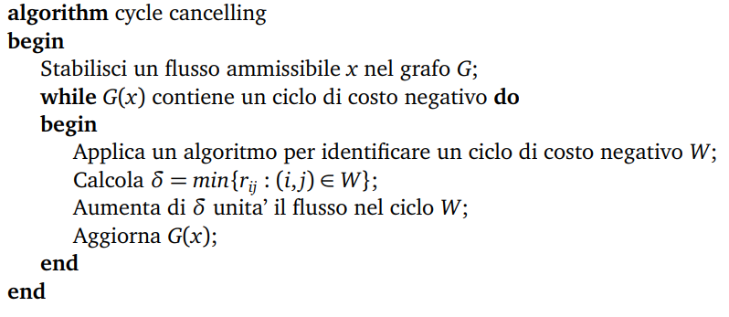

# Programmazione Lineare
## Problema Primale
### Trasformazione in forma standard
Dal problema primale in forma canonica:
$$
\begin{array}{ll}
	\text{min} & z=cx \\
	\text{s.t.} & Ax\ge b \\
	& x\ge0
\end{array}
$$
Otteniamo il problema primale in forma standard aggiungendo una variabile di _slack_ per trasformare i vincoli da disequazioni a equazioni:
$$
\begin{array}{ll}
	\text{min} & z = cx \\
	\text{s.t.} & Ax-Ix_s = b \\
	& x, x_s\ge0
\end{array}
$$
### Soluzioni base
Dato un problema primale in forma standard, la matrice $A$ puo' essere riscritta nella forma $A = [B, N]$ dove $B \in \mathbb{R}^{m,m}$ corrisponde a $m$ colonne linearmente indipendenti e $N \in \mathbb{R}^{m,n-m}$ sono le rimanenti $n-m$ colonne di $A$.
Ponendo $x^T=[x_B,x_N]$, il sistema dei vincoli puo' essere riscritto come:
$$
[B,N]=\left[\begin{array}{l}x_B\\x_N\end{array}\right]\rightarrow Bx_B+Nx_N=b
$$
e poiche' $B$ e' invertibile si ha: $x_B=B^{-1}b-B^{-1}Nx_N$
Se fissiamo $x_N=0$, la soluzione $x=[x_B,x_N]=[B^{-1},0]$ rappresenta una __soluzione base__. Nel caso in cui $x_B\ge0$ (i.e. soddisfa i vincoli di negativita') diremo che $x$ e' una ==soluzione base ammissibile==.
### Ottimizzazione della soluzione base
Il valore della funzione obiettivo corrispondente alla soluzione base $x=[x_B,x_N]=[B^{-1},0]$ e' dato dall'espressione:
$$
z=[c_B,c_N]\left[\begin{array}{l}x_B\\x_N\end{array}\right]= c_BB^{-1}b
$$
Per determinare come varia la funzione obiettivo per valori non nulli delle variabili non base $x_N$, dato che $x_B=B^{-1}b-B^{-1}Nx_N$ avremo:
$$
\begin{array}{l}
z=c_Bx_B+c_Nx_N=\\=c_B(B^{-1}b-B^{-1}Nx_N)+c_Nx_N=\\=c_BB^{-1}b-(c_BB^{-1}N-c_N)x_N
\end{array}
$$
Se definiamo $w=c_BB^{-1}$ possiamo scrivere:
$$
z=wb-(wN-c_N)x_N=wb-\sum_{k\in \mathbb{N}}(wa_k-c_k)x_k
$$
dove $\mathbb{N}$ e' l'insieme degli indici delle variabili/colonne non base.
Se $(wN-c_N)\le0$ la soluzione base ammissibile $x$ e' ottima. Nel caso, invece, esistesse una colonna $k$ non base tale che: $wa_k-c_k <0$ allora il valore della funzione obiettivo puo' decrescere dal valore attuale $z_0=c_BB^{-1}b=wb$ al valore: $z=z_0-(wa_k-c_k)x_k$
Il miglioramento della funzione obiettivo dipende dal valore massimo che la variabile $x_k$ puo' assumere, garantendo che la nuova soluzione sia sempre base ammissibile.
Per determinare quanto possiamo aumentare la variabile $x_k$ dobbiamo considerare l'equazione che determina la soluzione $x_B$ in funzione di $x_N$: $x_B=B^{-1}b-B^{-1}Nx_N$ che possiamo riscrivere come:
$$
x_B=\bar{b}-y^kx_k
$$
dove $\bar{b}=B^{-1}b$ e $y^k=B^{-1}a_k$ (ipotizzando che $x_j=0,\forall j\in \mathbb{N}\setminus\{k\}$)
Per ogni componente i-esima di $x_B, i=1,...,m$ abbiamo che: $x_i=\bar{b}-y^kx_k$
Se vogliamo che la soluzione base rimanga ammissibile dobbiamo aumentare $x_k$ in modo che $x_i=\bar{b_i}-y^kx_k \ge 0$
Quindi per ogni ogni $i$ la variabile $x_k$ deve rispettare la condizione: $x_k\le\frac{\bar{b_i}}{y^k_i}$
Il valore **massimo** che la variabile $x_k$ puo' assumere e' dato dal cosiddetto ==Rapporto di Minimo==:
$$
x_k=\frac{\bar{b_r}}{y^k_i}=min_{i=1,..,m}\left[\frac{\bar{b_i}}{y^k_i}:y^k_i>0\right]
$$
Nel caso in cui $y^k \le 0$ la funzione obiettivo e' illimitata, in quanto $(wa_k-c_K)>0$ e $x_k$ puo' arbitrariamente crescere garantendo l'ammissibilita' della soluzione.
Una volta aggiornato il valore della variabile $x_k$ tutte le variabili $x_i$ in base sono aggiornate come segue:
$$
x_i=\bar{b_i}-y^k_i\frac{\bar{b_r}}{y^k_r}
$$
mentre tutte le altre variabili non base diverse da $k$ rimangono nulle.
La variabile $x_r$ dopo essere stata aggiornata sara' nulla e la colonna $a_k$ sostituisce la colonna $a_r$ nella base $B$. Diciamo che $x_k$ entra in base, mentre $x_r$ esce dalla base.

## Algoritmo del Simplesso Primale
1. **Inizializzazione**: Definisce una soluzione base ammissibile: $x=[x_B,x_N]=[B^{-1}b,0]=[\bar{b},0]$ di costo $c_Bx_B=c_BB^{-1}b$
2. **Pricing**: Calcola $w=c_BB^{-1}$ che equivalea risolvere $wB=c_B$. Calcola i costi ridotti $wa_j-c_j$ per le variabili non-base $j\in \mathbb{N}$ e determina $wa_k-c_k=max_{j\in\mathbb{N}}\{wa_j-c_j\}$
3. **Condizioni di ottimalita'**: se $wa_k-c_k < 0$ allora la soluzione e' ottima
4. **La variabile $k$ e' candidata a entrare in base**: Calcola $y^k=B^{-1}a_k$ che equivale a risolvere $By^k=a_k$. Se $y^k\le0$ allora la soluzione e' illimitata.
5. **Rapporto minimo**: Calcola il valore da assegnare a $x_k$: $x_k=\frac{\bar{b_r}}{y^k_r}=min\{\frac{\bar{b_i}}{y^k_i}:y^k_i>0,i=1,..,m\}$ La variabile $x_r$ esce dalla base e $x_k$ entra al suo posto. Aggiorna $B,N$ e la soluzione base $x=[x_B,x_N]=[\bar{b},0]$. Ritorna allo step 2.
## Problema Duale
Si consideri il problema primale in forma canonica:
$$
\begin{array}{ll}
	z_P=\text{min} & cx \\
	\text{s.t.} & Ax\ge b \\
	& x\ge0
\end{array}
$$
Il cui insieme dei punti ammissibili e' $X=\{x:Ax\ge b,x\ge0\}$
Il suo problema duale e' il seguente:
$$
\begin{array}{ll}
	z_D=\text{max} & wb \\
	\text{s.t.} & wA\le c \\
	& w\ge0
\end{array}
$$
Il cui insieme dei punti ammissibili e' $W=\{w:wA\le c,w\ge0\}$
### Come ottenere il duale
Partendo dal problema primale in forma **standard**:
$$
\begin{array}{ll}
	x_P=\text{min}  & cx \\
	\text{s.t.}& Ax-Ix_s = b \\
	&x,x_s\ge0
\end{array}
$$
Dove $I=[a_{n+1},..,a_{n+m}]=[e_1,\dots,e_m]$ e' la matrice identita' di ordine m, questo perche' le variabili di **slack** del problema appaiono nelle equazioni dei vincoli come con coefficente $-1$ se le disequazioni de vincoli nella forma canonica del problema avevano segno $\ge$. (Quindi per ottenere il duale dobbiamo prima riportare tutti i vincoli nella forma canonica al segno $\ge$ e trasformare il problema nella sua forma standard.)
In corrispondenza di una soluzione ottima del primale deve esistere una base $B$ per cui: $wa_j-c_j\le0, i=1,\dots,n+m$ dove $w=c_BB^{-1}$
Riscrivendo la disequazione $wa_j-c_j\le0$ per le variabili originarie e quelle di slack si ha:
$$wa_j\le c_j, j=1,\dots,n$$
$$-we_i\le0, i=1,\dots,m$$
che in forma matriciale puo' essere riscritta come: $wA\le c$ $w\ge0$ da cui: $W=\{w: wA\le c, w\ge0\}$ e' l'insieme delle soluzioni ammissibili per problema duale.
## Dualita'
### Dualita' debole
Se $\tilde{x}\in X=\{x:Ax\ge b,x\ge0\}$ e $\tilde{w}\in W=\{w:wA\le c, w\ge0\}$ allora $\tilde{w}b\le c\tilde{x}$
### Corollario 1
Se $x^*\in X$ e $w^*\in W$ soddisfano $w^*b=cx^*$ allora $x^*$ e' soluzione ottima del primale e $w^*$ e' soluzione ottima del duale.
### Dualita' forte
Se esistono soluzioni ammissibili sia per il primale che per il duale, allora esistono due soluzioni ottime i cui valori coincidono
#### Teorema 1 (Dualita' forte)
Se $X\ne \emptyset$ e $W\ne \emptyset$, allora esiste una soluzione $x^*$ ottima per il primale e una soluzione $w^*$ ottima per il duale. Inoltre $w^*b=cx^*$
### Condizioni di Complementarieta'
#### Corollario 2
Le soluzioni $\tilde{x}\in X$ del primale e $\tilde{w}\in W$ del duale sono ottime $\iff$ $\text{a} \land \text{b}$ dove:
$$\text{a} \rightarrow \tilde{w}(A\tilde{x}-b)=0$$
$$\text{b} \rightarrow (c-\tilde{w}A)\tilde{x}=0$$
Questo corollario stabilisce che data una soluzione del primale $\tilde{x}\in X$ per dimostrarne l'ottimalita' e' sufficiente trovare una soluzione duale $\tilde{w}\in W$ che soddisfi le condizioni di complementarieta'.
Inoltre $\text{a}$ e $\text{b}$ corrispondono alle equazioni:
$$\text{a'}\rightarrow w_i(a^ix-b_i)=0,\text{ }i=1,\dots,m$$
$$\text{b'}\rightarrow (c_j-wa_j)x_j=0,\text{ }j=1,\dots,n$$
dalle quali si derivano le seguenti osservazioni:
- $w_i>0\implies a^ix=b_i$
- $a^ix>b_i\implies w_i=0$
- $x_j>0\implies wa_j=c_j$
- $wa_j<c_j\implies x_j=0$

## Simplesso Formato Tableau
Permette di semplificare le operazioni di aggiornamento della base, della corrispondente soluzione, e dei costi ridotti $wa_j-c_j$ ad ogni iterazione:
$$
\begin{array}{ll}
	\text{min z}=  & cx_B+cx_N \\
	\text{s.t.}& Bx_B+Nx_N = b \\
	&x_B,x_N\ge0
\end{array}
$$
che si puo' ridurre come:
$$
\begin{array}{ll}
	\text{min}&\text{z} \\
	&\text{z}- cx_B-cx_N=0 \\
	& x_B+B^{-1}Nx_N = B^{-1}b \\
	&x_B,x_N\ge0
\end{array}
$$
Moltiplicando la seconda equazione per $c_B$ e sommandola per la prima si ottiene:
$$
\begin{array}{ll}
	\text{min}&\text{z} \\
	&\text{z} &+&0x_B &+& (c_BB^{-1}N-c_N)x_N &=& c_BB^{-1}b \\
	&&& x_B&+&B^{-1}Nx_N &=& B^{-1}b \\
	&&&x_B&,&x_N&\ge&0
\end{array}
$$
Il risultato puo' essere inserito in un "tableau" come segue:
$$
\begin{array}{|c|c|}
\hline
& \text{z} & x_B & x_N & RHS \\ \hline
\text{z} & 1 & 0 & c_BB^{-1}N-c_N & c_BB^{-1}b \\ \hline
x_B      & 0 & I & B^{-1}N & B^{-1}b \\ \hline
\end{array}
$$
dove il Right Hand Side (RHS) contiene il valore della funzione obiettivo e delle variabili base.
In una versione di maggiore dettaglio il _"tableau"_ e' il seguente:

Come si puo' notare il tableau contiene tutte le informazioni necessarie per l'esecuzione dell'algoritmo del simplesso.
L'operazione base e' il *==pivoting==*. Che permette a una nuova variabile di entrare in base e di aggiornare *correttamente* tutte le informazioni nel tableau (costi ridotti, valore variabili base, etc.).
### Operazione di Pivoting
- Ad ogni iterazione si seleziona la variabile non base candidata ad entrare in base e si definisce con il criterio del rapporto minimo la variabile base che uscira':
	- La variabile entrante si seleziona scegliendo la colonna che massimizza il *costo ridotto* $wa_k-c_k$ presente nella riga $0$.
	- La variabile uscente si seleziona scegliendo la riga che minimizza il rapporto $\frac{\bar{b_i}}{y^k_i}$ con $y^k_i > 0$.
- Si divide la riga $i$ per $y^k_i$ (che sicuramente e' positivo).
- Ad ogni riga $i' \ne i$ si aggiunge la riga $i$ moltiplicata per $-y^k_{i'}$
- Alla riga $0$ si aggiunge la riga $i$ moltiplicata per $-(wa_k-c_k)$.
### Come determinare una base iniziale
#### Caso facile
Se il problema di $n$ variabili e $m$ vincoli ha la seguente forma:
$$
\begin{array}{ll}
z_P & = & \text{min}& cx \\
&&\text{s.t.}&Ax \le b \\
&&&x \ge 0
\end{array}
$$
quando si aggiungono le $m$ variabili $x_s$ di ==slack== alle $n$ variabili originarie, il primale in forma standard e' il seguente:
$$
\begin{array}{ll}
z_P & = & \text{min}& cx \\
&&\text{s.t.}&Ax&+&Ix_s&=&b \\
&&&x&,&x_s&\ge&0
\end{array}
$$
dove $I=[e_1,\dots,e_m]$ e' la matrice identita' di ordine $m$, che senz'altro puo' essere una base $B=I$, la quale e' anche ammissibile se $b\ge0$.
#### Metodo Big-M
Se il problema ha la seguente forma
$$
\begin{array}{ll}
z_P & = & \text{min}& cx \\
&&\text{s.t.}&Ax = b \\
&&&x \ge 0
\end{array}
$$
non e' detto sia facile individuare una base $B$ tra le colonne di $A$.
Nell'ipotesi che $b\ge0$, si possono aggiungere $m$ variabili $x_A$, dette *==artificiali==*, alle n variabili originarie, e risolvere il seguente problema:
$$
\begin{array}{ll}
z_P & = & \text{min}& cx &+&Mx_A  \\
&&\text{s.t.}&Ax&+&Ix_A&=&b \\
&&&x&,&x_A&\ge&0
\end{array}
$$
dove $I$ e' la matrice identita' di ordine $m$ e $M=MI$, con $M>0$ scelto *sufficientemente grande*.
#### Metodo 2-Fasi
Sia dato un problema della seguente forma:
$$
\begin{array}{ll}
(P)&z_P&=&\text{min}&cx \\
&&&\text{s.t.}&Ax&=&b\\
&&&&x&\ge&0
\end{array}
$$
Nell'ipotesi che $b\ge0$, si possono aggiungere $m$ variabili $x_A$, dette *==artificiali==*, alle $n$ variabili originarie, e risolvere il seguente problema:
$$
\begin{array}{ll}
(P')&z_{P'} & = & \text{min}& 1x_A  \\
&&&\text{s.t.}&Ax&+&Ix_A&=&b \\
&&&&x&,&x_A&\ge&0
\end{array}
$$
dove $I$ e' la matrice identita' di ordine $m$ e $1=\{1,1,\dots,1\}$, e' un vettore di $m$ componenti tutte pari a $1$.
In questo caso i problemi $P$ e $P'$ non sono equivalenti.
Risolvere il problema $P'$ serve solo a determinare una soluzione base ammissibile per il problema $P$.
Sia $(x^*,x_A^*)$ la soluzione ottima del problema $P'$ di valore $x_{P'}$. Si possono presentare tre casi:
- $z_{P'}>0\implies$ il problema $P$ non ha una base ammissibile;
- $z_{P'}=0$ e nessuna variabile artificiale e' base$\implies$ il problema $P$ ha una base ammissibile;
- $z_{P'}=0$ e almeno una variabile artificiale e' in base$\implies$ il problema $P$ ha una base ammissibile, ma bisogna *estrarla*:
---
Se $x_{P'}=0$ e una variabile artificiale e' in base, per generare una base senza variabili artificiali e' necessario farla uscire.
Questo caso si verifica quando la soluzione e' ==degenere==,ossia una variabile in base ha valore nullo:

se esiste un $y^j_i \ne 0$, allora possiamo ==pivotare== su questo coefficiente e la variabile $x_j$ entra in base al posto della variabile artificiale $x^A_h$.
Se $y^j_i = 0$, per ogni $j=1,\dots,n$, allora possiamo eliminare dal tableau sia la riga $i$ che la colonna della variabile artificiale $x^A_h$.
#### Degenerazione
La ==degenerazione== si presenta quando alcuni $\bar{b_i}$ sono nulli.
In caso di degenerazione, quando si applica il rapporto minimo, il valore da assegnare alla variabile entrante e' sempre nullo:
$$
x_k=\frac{\bar{b_r}}{y^k_r}=\text{min}\{\frac{\bar{b_i}}{y^k_i}:y^k_i>0,i=1,\dots,m\}=0
$$
Per cui cambia la base, ma non il punto estremo che coincide con il precedente. Il rischio e' che il metodo torni a *spostarsi* su una base gia' considerata nelle precedenti iterazioni.
Si consideri il seguente esempio:

Il metodo potrebbe avere un ==ciclo== che coinvolge le basi associate ai tre punti estremi, A, B e C che corrispondono a tre diverse soluzioni base, ma coincidono.
La ==Regola di Bland== stabilisce che per evitare la ==degenerazione ciclante== e' sufficiente scegliere tra le variabili candidate a entrare in base (i.e., $wa_j-c_j$ positivi) e quelle candidate a uscire dalla base (i.e. che soddisfano il criterio del rapporto minimo) quelle di indice minimo.
Il metodo del simplesso, se implementa un metodo per evitare la degenerazione ciclante, nel caso peggiore deve generare tutte le possibili basi che sono un numero finito:
$$
\binom{n}{m}=\frac{n!}{m!(n-m)!}
$$
## Il Metodo del Simplesso Duale
Il Simplesso primale, ad ogni iterazione, soddisfa:
- L'ammissibilita' primale della soluzione: $\bar{b_r}\ge0$ per ogni $r$;
- Le condizioni di Complementarieta'
Il Metodo del Simplesso Duale, ad ogni iterazione, soddisfa:
- L'ammissibilita' duale della soluzione: $wa_j-c_j\le0$ per ogni $j$;
- Le condizioni di Complementarieta'
Le Condizioni di Complementarieta' sono soddisfatte perche' le variabili $x_j$ che sono in base hanno $wa_j-c_j=0$ mentre quelle non in base hanno valore nullo ($x_j=0$).

Quando applichiamo il simplesso Duale dobbiamo avere che tutti i vincoli duali siano soddisfatti, quindi che $wa_j-c_j\le0$ per ogni $j$.
Se tutte le variabili sono non negative la soluzione e' OTTIMA.
Se invece almeno una variabile in base ha valore negativo (i.e. esiste almeno un $r$ tale che $\bar{b_r}<0$) allora dobbiamo farla diventare maggiore o uguale a 0.
Se effettuiamo una operazione di pivoting sulla riga $r$ e su una qualunque colonna $k$ tale che $y^k_r<0$ allora nel nuovo tableau avremo $\bar{b_r}>0$, perche' $\bar{b_r}=\frac{\bar{b_r}}{y^k_r}$
La colonna $k$ deve essere scelta in modo da conservare l'ammissibilita' duale: $wa_j-c_j\le0$ per ogni $j$.
Quando pivotiamo sulla riga $r$ e la colonna $k$ la riga $0$ del tableau viene aggiornata come segue:
$$
(wa_j-c_j)=(wa_j-c_j)-\frac{y^j_r}{y^k_r}(wa_k-c_k)
$$
Per conservare l'ammissibilita' duale abbiamo bisogno che:
$$
(wa_j-c_j)-\frac{y^j_r}{y^k_r}(wa_k-c_k)\le0
$$
Siccome $\frac{(wa_k-c_k)}{y^k_r}\ge0$, se $y^j_r\ge0$ avremo che il valore aggiornato di $(wa_j-c_j)$ sara' sicuramente non positivo.
Invece se $y^j_r<0$ avremo bisogno di soddisfare il seguente vincolo:
$$
\frac{wa_k-c_k}{y^k_r}=\text{min}\{\frac{wa_j-c_j}{y^j_r}:y^j_r<0,j=1,\dots,n\}
$$
### Algoritmo del Simplesso Duale
- Step 1: Inizializzazione:
	Sia **B** una base duale ammissibile: $wa_j-c_j=c_BB^{-1}a_j-c_j\le0$
- Step 2: Determinazione riga $r$:
	$\bar{b_r}=\text{min}\{\bar{b_i}:i=1,\dots,m\}$.
	Se $\bar{b}\ge0$, allora STOP perche' la soluzione e' primale ammissibile e quindi ottima.
- Step 3: Determinazione colonna $k$:
	Applica il rapporto minimo:
	$$\frac{wa_k-c_k}{y^k_r}=\text{min}\{\frac{wa_j-c_j}{y^j_r}:y^j_r<0,j=1,\dots,n\}$$
	Se $y^j_r\ge0$, per ogni $j=1,\dots,n$, allora STOP perche' il duale e' illimitato e la soluzione ammissibile del primale non esiste.
- Step 4: Pivoting
	Svolge una operazione di pivoting sull'elemento $(r,k)$.
	Ritorna allo step 2.
#### NOTE
- Il valore della funzione obiettivo $\text{z}=c_Bx_B=c_BB^{-1}b$ e' un lower bound.
- Durante l'esecuzione del simplesso duale il valore della funzione obiettivo cresce in modo monotonico non descrescente, perche: $c_B\bar{b}=c_B\bar{b}-\frac{\bar{b_r}}{y^k_r}(wa_k-c_k)$
- Come possiamo gestire il caso in cui la base non sia duale ammissibile (i.e., esiste almeno un $j$ per cui $wa_j-c_j>0$)?
	Possiamo aggiungere il seguente vincolo artificiale:
	$$\sum_{j\in N}x_j\le M\implies\sum_{j\in N}x_j+x_{n+1}=M$$
	Dove $N$ e' l'insieme delle variabili non base ed $M\tilde{A}$ un valore positivo sufficientemente grande.
	Dopodiche' si deve pivotare sulla colonna $k$ tale che:
	$$wa_k-c_k=\text{max}\{wa_j-c_j:j\in N\}$$
	Se al termine del simplesso duale $x_{n+1}>0$ la soluzione e' ottima, altrimenti se $x_{n+1}=0$ (cioe' la variabile artificiale e' fuori dalla base) la soluzione e' illimitata.
---

# Programmazione lineare intera
## Metodi Branch and Bound
Consideriamo il problema IP di programmazione lineare intera:
$$
\begin{array}{ll}
&z_{IP} & = & \text{min}& cx  \\
&&&\text{s.t.}&Ax&\ge&b \\
&&&&x&\ge&0& \text{and integer}
\end{array}
$$
Il rilassamento lineare LP del problema IP e' dato da:
$$
\begin{array}{ll}
&z_{LP} & = & \text{min}& cx  \\
&&&\text{s.t.}&Ax&\ge&b \\
&&&&x&\ge&0
\end{array}
$$
Se la soluzione ottima $x^*$ del problema LP e' intera, allora e' la soluzione ottima anche per il problema intero IP.
Cosa accade se invece la soluzione ottima $x^*$ e' frazionaria?
Una possibilita' e' l'applicazione del metodo Branch and Bound, in generale e' necessario ==stabilire un criterio per selezionare una variabile frazionaria== (che deve essere intera nella soluzione ottima di IP), per fare un ==branch==.
### Regola di Branching
Data la soluzione ottima del problema LP e la variabile frazionaria $x_j$ selezionata, una possibile ==regola di branching== puo' prevedere la creazione di due sottoproblemi:
- $P(x_j\le\lfloor x_j\rfloor)$: ottenuto da LP aggiungendo il vincolo $x_j\le \lfloor x_j\rfloor$
- $P(x_j\ge\lceil x_j\rceil)$: ottenuto da LP aggiungendo il vincolo $x_j\ge\lceil x_j\rceil$
La soluzione frazionaria $x_j$ e' esclusa in entrambi i sottoproblemi.
Se consideriamo il problema LP originale come ==nodo radice== di un albero di ricerca, i due sottoproblemi sono i due ==nodi figli==.
Il processo di branching descritto per il nodo radice e' ripetuto per i nodi figli, per cui la regola di branching e' applicata a ogni nodo $k$ dell'albero di ricerca (dove $k=0$ e' il nodo radice e $k=1,2$ i suoi nodi figli).
### Lower e Upper Bound
Per ogni nodo $k$ dobbiamo risolvere il sottoproblema $P_k$ ottenendo la soluzione $x_k$ di costo $z_k$.
- Se $P_k$ ==non ha soluzione ammissibile== poniamo $z_k=+\infty$ e non generiamo nodi figli.
- Se la soluzione $x_k$ di $P_k$ e' ==intera==, allora e' sicuramente un ==upper bound== alla soluzione ottima del problema intero originario IP e non e' necessario generare ulteriori nodi figli del nodo $k$.
- Se la soluzione $x_k$ di $P_k$ e' ==frazionaria==, allora il coso $z_k$ rappresenta un ==lower bound== ($LB_k = z_k$) al valore della migliore soluzione intera che si puo' ottenere nel sottoalbero di cui il nodo $k$ e' il nodo radice.
La miglior soluzione intera ammissibile finora trovata ha costo $z_{UB}$ (i.e. e' il miglior upper bound finora trovato).
L'upper bound $z_{UB}$ puo' essere inizializzato a $+\infty$ oppure con il valore della soluzione generata con un ==algoritmo euristico==.
Oltre a ottenere un upper bound quando la soluzione $x_k$ di $P_k$ e' intera, lo si puo' ottenere utilizzando un ==algoritmo euristico per ripristinare l'ammissibilita' intera== della soluzione $x_k$ quando e' frazionaria.
L'upper bound $z_{UB}$ e' molto importante perche' permette di ==eliminare in anticipo== quei nodi che non consentiranno di ottenere la soluzione ottima, evitando di esplorare il corrispondente sotto-albero.
Se per un nodo $k$ la soluzione di $P_k$ ha costo $z_k \ge z_{UB}$ allora il nodo non deve essere "==espanso==" (i.e. non devono essere generati i nodi figli) perche' non consentiranno di ottenere una soluzione di costo inferiore a $z_{UB}$ (conosciamo gia' una soluzione di costo $z_{UB}$).
Migliore e' il valore $z_{UB}$ e tanto piu' velocemente e piu' veloce sara' la convergenza e la quantita' di memoria risparmiata.
### Metodo di visita dell'albero
Quando a un nodo $k$ viene svolto un branching vengono generati due nodi figli che vengono inseriti in un ==heap==.
L'ordine in cui i nodi sono estratti dalla heap per essere *risolti* determina il metodo di visita dell'albero di ricerca.
I metodi di visita dell'albero di ricerca piu' noti sono i seguenti:
- ==Depth-First Search==: ricerca in profondita', esplorando i nodi figli prima di fare backtracking.
- ==Breadth-First Search==: esplora l'albero di ricerca un livello alla volta, i.e. estrae dalla heap prima i nodi dei livelli di indice piu' piccolo.
- ==Best-First Search==: ad ogni iterazione estrae dalla heap il nodo con il lower bound piu' basso.
Non esiste un metodo migliore di altri. La scelta dipende dal modello che si vuole risolvere e dalle performance a cui si e' interessati.
### Algoritmo Branch and Bound
- Step 1. Poni $z_{UB} = +\infty$ e inserisci nella heap vuota il problema $P_0 : z_0 = \text{min}\{cx:Ax\le b, x\ge0\}$.
- Step 2. Estrai il problema $P_k$ dalla heap (se e' vuota STOP) e ottieni la soluzione $x_k$ di costo $z_k$ ($z_k = +\infty$ se non ha soluzione).
- Step 3. Se $z_k \le z_{UB}$ torna allo Step 2 (il nodo $k$ non viene espanso).
- Step 4. Se la soluzione $x_k$ e' intera, allora aggiorna l'upper bound: $z_{UB} = z_k$ e $x = x_k$ (avendo passato lo Step 3, $z_k < z_{UB}$). Elimina dalla heap tutti i nodi $P_k$ per cui $z_k \le z{UB}$. Torna allo Step 2.
- Step 5. Seleziona una variabile $x_j$ frazionaria nella soluzione $x_k$ e inserisci nella heap due nodi figli $P(x_j \le \lfloor x_j \rfloor$) e $P(x_j \ge \lceil x_j \rceil)$. Torna allo Step 2.

I problemi $P_k$ possono essere risolti usando il ==metodo del simplesso==.
Per risolvere il problema $P_k$ in modo efficiente sarebbe utile partire dalla base del nodo padre. Per cui, quando si salva in heap il nodo dovrebbe essere necessario salvare anche questa informazione.
Per includere in $P_k$ tutti i vincoli imposti dalla regola di branching e' necessario individuare (o conservare) i vincoli definiti dal "cammino" dal nodo $k$ fino alla radice dell'albero di ricerca.

### Tagli di Gomory
Consideriamo un problema $P$ di programmazione lineare intera: $z = \text{min}\{cx:Ax\ge b, x\ge0\text{ e intera}\}$.
Se il problema $P$ ha una soluzione ammissibile e lo risolviamo con il simplesso (primale o duale), potremo ottenere il seguente tableau ottimo:

Ipotizziamo che la variabile in corrispondenza della riga $i$ (in questo caso $x_i$) abbia un valore $b_i$ frazionario.
Quale vincol possiamo aggiungere per "==escludere==" questa soluzione frazionaria dall'insieme delle soluzioni ammissibili senza escludere anche le soluzioni intere?
Costruiamo delle disuguaglianze valide note come ==Tagli di Gomory==.
Se consideriamo il tableau ottimo, l'equazione corrispondente alla riga $i$ puo' essere scritta come segue:
$$x_i+\sum^n_{j=m+1}y^j_ix_j=\bar{b_i}$$
Possiamo decomporre le quantita' $y^j_i$ e $\bar{b_i}$ nelle componenti intere e frazionarie: $y^j_i = I^j_i + F^j_i$ e $\bar{b_i} = I_i + F_i$
dove
$I^j_i = \lfloor y^j_i\rfloor$ e $F^j_i = y^j_i - I^j_i$ con $(0\le F^j_i<1)$
$I_i = \lfloor \bar{b_i}\rfloor$ e $F_i = \bar{b_i} - I_i$ con $(0\le F_i<1)$
Siccome 
$$F_i - \sum^n_{j=m+1}F^j_ix_j < 1$$
ma $F_i - \sum^n_{j=m+1}F^j_ix_j$ deve essere anche intero, allora:
$$F_i - \sum^n_{j=m+1}F^j_ix_j \le 0$$
che corrisponde al seguente vincolo, detto ==Taglio di Gomory==:
$$-\sum^n_{j=m+1}F^j_ix_j\le -F_i$$
che non e' soddisfatto dalla soluzione corrente, perche' $x_j = 0$ per ogni $j = m + 1,\dots,n$ dato che sono non base, mentre $F_i > 0$ visto che abbiamo ipotizzato che $\bar{b_i}$ e' frazionario.
Per semplicita' avevamo ipotizzato che la base fosse costituita dalle prime $m$ colonne. Nel caso generale, il Taglio di Gomory relativo alla variabile in base frazionaria in corrispondenza della riga $i$ puo' essere riscritto come:
$$-\sum_{j\in N}F^j_ix_j\le -F_i$$
dove $N$ e' l'insieme delle colonne non in base.
Se risolviamo il problema con il Simplesso, quando aggiungiamo il nuovo vincolo al problema non e' necessario ripetere l'algoritmo dall'inizio, ma possiamo ripartire dalla base corrente.
Se le variabili attualmente incluse sono $n$, il taglio di Gomory corrisponde a una nuova riga da aggiungere al tableau:
$$-\sum_{j\in N}F^j_ix_j+x_{n+1}=-F_i$$

---
## Metodi di decomposizione
### Rilassamento Lagrangiano
Il rilassamento Lagrangiano permette di ottenere un lower bound per il problema P nel seguente modo:
- alcuni vincoli considerati *difficili* sono rimossi;
- i vincoli rimossi sono inseriti nella funzione obiettivo per mezzo delle *penalita' Lagrangiane*
Per esempio nel problema P, si rilassano i vincoli usando il vettore non negativo di penalita' Lagrangiane $\lambda$, si ottiene la seguente formulazione LR:
$$
\begin{array}{ll}
&z_{LR}(\lambda) & = & \text{min}& cx & + & \lambda(b-Ax)  \\
&&&\text{s.t.}&Bx&\ge&d \\
&&&&x&\ge&0 \text{ and integer} \\
\end{array}
$$

### Dualita' Lagrangiana Debole
$z_{LR}(\lambda)$ e' un valido lower bound al valore della soluzione ottima di P, i.e, $z_{LR}(\lambda) \le z_P$, per ogni $\lambda \ge 0$.
Dimostrazione:
Sia $x^*$ la soluzione ottima di P.
Siccome $x^*$ e' una soluzione ammissibile anche per $LR(\lambda)$, per ogni $\lambda \ge 0$, si ha che:
$$z_{LR}(\lambda,x^*) = cx^* + \lambda(b-Ax^*) \ge z_{LR}(\lambda)$$
Pero' $\lambda(b-Ax^*) \le 0$, perche' $\lambda \ge 0$ e $Ax^* \ge b$, quindi:
$$z_{LR} \le z_{LR}(\lambda, x^*) \le z_P, \forall \lambda \ge 0$$

Il sottoproblema LR e' detto ==problema Lagrangiano==.
Per identificare il vettore di penalita' $\lambda$ che massimizza il lower bound $z_{LR}$ si deve risolvere il cosiddetto ==Lagrangiano Duale==, che puo' essere formulato come segue:
$$z_{LR} = \text{max}\{z_{LR}(\lambda):\lambda\ge0\}$$
dove per ogni vettore di penalita' fissato deve essere risolto un problema Lagrangiano LR, che puo' essere riscritto come:
$$
\begin{array}{ll}
&z_{LR}(\lambda) & = & \text{min}& (c-\lambda A)x &+& \lambda b  \\
&&&\text{s.t.}&Bx&\ge&d \\
&&&&x&\ge&0 \text{ and integer}
\end{array}
$$
Il lower bound $z_{LR}$ fornito dal Lagrangiano duale e' maggiore o uguale a quello fornito dalla soluzione ottima $z_{LP}$ del rilassamento lineare del problema P, i.e. $z_{LR} \ge z_{LP}$.
Se il lower bound $z_{LR}$ e' strettamente minore alla soluzione ottima del problema P, $z_{LR} <  z_P$, allora si dice che c'e' ==Duality Gap.==
Si noti che e' possibile aggiungere al problema LR dei nuovi vincoli ridondanti nella formulazione originale P, ma che possono aiutare la convergenza ed eventualmente migliorare il lower bound $z_{LR}$.
Per risolvere il problema LR il metodo piu' usato e' il ==subgradiente==.

### Set Covering Problem
Il Set Covering Problem (SC) e' il problema di *coprire* le righe di una matrice A, con coefficienti $a_{ij} \in \{0,1\}$ e di dimensione $m \times n$, con un sottoinsieme S di colonne di costo minimo.
Sia $x_j$ una variabile binaria 0-1 uguale a 1 se la colonna $j$ di costo $c_j$ e' in soluzione, 0 altrimenti. Un modello per il problema SC e':
$$
\begin{array}{ll}
&z_{SC} & = & \text{min}& \sum_{j=1}^n c_jx_j  \\
&&&\text{s.t.}&\sum_{j=1}^n a_{ij}x_j&\ge&1, & i=1,\dots,m\\
&&&&x&\in&\{0,1\}, & j=1,\dots,n
\end{array}
$$
Il Rilassamento Lagrangiano del problema SC rispetto ai vincoli e' il seguente:
$$
\begin{array}{ll}
&z_{LR}(\lambda)&=&\text{min}\sum_{j=1}^nc_jx_j&+&\sum_{i=1}^m\lambda_i(1-\sum_{j=1}^na_{ij}x_j) \\
&&\text{s.t.}&x_j \in \{0,1\}, &&j=1,\dots,n
\end{array}
$$
Se si definisce il costo *penalizzato* $c'_j = c_j - \sum_{i-1}^m \lambda_ia_{ij}, j=1,\dots,n$, il problema $LR(\lambda)$ puo' essere riscritto come segue:
$$
\begin{array}{ll}
&z_{LR}(\lambda)&=&\text{min}\sum_{j=1}^nc'_jx_j&+&\sum_{i=1}^m\lambda_i \\
&&\text{s.t.}&x_j \in \{0,1\}, &&j=1,\dots,n
\end{array}
$$
la cui soluzione ottima $x^*$ puo' essere calcolata ponendo, per ogni $j=1,\dots,n$:
$$
x^*_j = 
\begin{cases}
1 & \text{se } c'_j \le 0\\
0 & \text{altrimenti}
\end{cases}
$$
### Dualita' Lagrangiana Forte
Dato il problema P, sia $\bar{x}$ la soluzione ottima di $z_{LR}(\bar{\lambda})$ per un dato $\bar{\lambda}\ge0$. Se $\bar{x} \text{ e }\bar{\lambda}$ soddisfano le seguenti condizioni:
- $\bar{x}$ e' ammissibile per P (i.e., $A\bar{x}\ge b$)
- $\bar{\lambda}(b-A\bar{x}) = 0$

Allora $\bar{x}$ e' la soluzione ottima di P e $z_{LR} = z_{LR}(\bar{\lambda})$.
Dimostrazione (la soluzione $\bar{x}$ e' una soluzione ottima di P):
Essendo $\bar{x}$ una soluzione ammissibile di P si ha:
$$c\bar{x} \ge z_P$$
Per il teorema della dualita' Lagrangiana debole si ha:
$$z_P \ge z_{LR}(\lambda) = c\bar{x}+\bar{\lambda}(b-A\bar{x})$$
dove $\bar{\lambda}(b-A\bar{x}) = 0$, per cui si ottiene:
$$c\bar{x} \ge z_P \ge c\bar{x} \implies z_P = c\bar{x}(=z_{LR}(\bar{\lambda}))$$
Dimostrazione ($z_{LR} = z_{LR}(\bar{\lambda}))$
Dalla definizione di Lagrangiano Duale $z_{LR}$ si ha:
$$z_{LR} \ge z_{LR}(\bar{\lambda})$$
Mentre, dalla dualita' Lagrangiana debole si ha:
$$z_P \ge z_{LR}$$
Quindi, dalle disequazioni precedenti si ottiene:
$$c\bar{x} \ge z_P \ge c\bar{x} \implies z_P = c\bar{x}(=z_{LR}(\bar{\lambda}))$$
Dimostrazione ($z_{LR} = z_{LR}(\bar{\lambda}))$
Dalla definizione di Lagrangiano Duale $z_{LR}$ si ha:
$$z_{LR} \ge z_{LR}(\bar{\lambda})$$
Mentre, dalla dualita' lagrangiana debole si ha:
$$z_P \ge z_{LR}$$
Quindi si ottiene:
$$z_{LR} = z_{LR}(\bar{\lambda})$$
### Rilassamento Lineare vs Rilassamento Lagrangiano
Per comodita' il problema P puo' essere riscritto nella seguente forma compatta:
$$
\begin{array}{ll}
&z_P & = & \text{min}& cx  \\
&&&\text{s.t.}&Ax&\ge&b \\
&&&&x&\in&X
\end{array}
$$
dove $X = \{x:Bx\ge d, x \ge 0 \text{ and integer}\}$
Il rilassamento lineare (LP) del problema p e' ottenuto rilassando il vincolo di interezza delle variabili $x$.
Il valore ottimo $x_{LP}$ del rilassamento lineare di P e' un valido lower bound al valore $z_P$ della soluzione ottima di P, i.e. $z_{LP} \le z_P$.
Si denota con $conv(X)$ l'inviluppo convesso di $X$, che e' dato dall'intersezione di tutti gli insiemi convessi che contengono $X$.

### Teorema (Caratterizzazione del Lagrangiano Duale)
Dato il problema $z_P = \text{min}\{cx:Ax \ge b, x \in conv(X)\}$. se si rilassano in modo Lagrangiano i vincoli $Ax \ge b$, il costo della soluzione ottima $z_{LR}$ del Lagrangiano Duale e' uguale al costo della soluzione ottima del seguente problema di programmazione lineare:
$$
\begin{array}{ll}
&z_{LR} & = & \text{min}& cx  \\
&&&\text{s.t.}&Ax&\ge&b \\
&&&&x&\in&X
\end{array}
$$
Dimostrazione:
Il Lagrangiano Duale e' definito come:
$$z_{LR} = \text{max}\{z_{LR}(\lambda):\lambda \ge 0\} = \text{max}_{\lambda\ge0}\{\text{min}_{x\in X}\{cx+\lambda(b-Ax)\}\}$$
Se $T$ e' l'insieme dei punti estremi del poliedro $X$ (chi si e' ipotizzato limitato e non vuoto) allora:
$$z_{LR} = \text{max}_{\lambda\ge0}\{\text{min}_{t\in T}\{cx^t+\lambda(b-Ax^t)\}\}$$
che equivale al seguente problema:
$$
\begin{array}{ll}
&z_{LR} & = & \text{max}& z  \\
&&&\text{s.t.}&z&\le&cx^t + \lambda(b-Ax^t), & t\in T \\
&&&&\lambda&\ge&0
\end{array}
$$
(Questo e' il master della decomposizione di Benders)
Il Duale del problema precedente e':
$$
\begin{array}{ll}
&z_{LR} & = & \text{min}& \sum_{t\in T}(cx^t)\alpha_t  \\
&&&\text{s.t.}&\sum_{t\in T}(b-Ax^t)\alpha_t&\le&0 \\
&&&&\sum_{t\in T}\alpha_t & = & 1\\
&&&&\alpha_t&\ge&0, & t\in T
\end{array}
$$
(Questo e' il master della decomposizione di Dantzing-Wolfe)
Definendo $x=\sum_{t\in T}x^t\alpha_t$, dal problema precedente si ottiente il teorema:
$$
\begin{array}{ll}
& \text{min}& cx  \\
&\text{s.t.}&Ax&\ge&b \\
&&x&\in&conv(X)
\end{array}
$$
Questo teorema e' importante perche':
- caratterizza il Lagrangiano Duale
- stabilisce l'equivalenza tra il rilassamento Lagrangiano e le decomposizioni di Dantzig-Wolte e Benders

### Teorema (Relazione tra Rilassamento Lagrangiano e LP)
Il lower bound ottenuto dal rilassamento Lagrangiano del problema P e' sempre maggiore o uguale del lower bound ottenuto dal Rilassamento Lineare di P, i.e. $z_{LP} \le z_{LR}$
Dimostrazione:
Siccome $conv(X) \subseteq \{x:Bx \ge d, x\ge 0\}$, l'insieme delle soluzioni del Lagrangiano Duale dato da $\{x:Ax\ge b, x\in conv(X)\}$ e' contenuto nell'insieme delle soluzioni di LP dato da $\{x:Ax\ge b,Bx \ge d, x\ge 0\}$:
$$\{x:Ax\ge b, x\in conv(X)\}\subseteq \{x:Ax\ge b, Bx\ge d, x\ge0\}$$
da cui segue che $z_{LP} \le z_{LR}$
Si hanno le seguenti proprieta':
- $z_P = z_{LR}$ se e solo se:
$$
\begin{array}{}
& conv(X \cap \{x:Ax \ge b, x \ge 0\}) \\
& = \\
& conv(X) \cap conv(\{x:Ax \ge b, x \ge 0\})
\end{array}
$$
- $z_{LP} = z_{LR}$ se (Proprieta' di Integralita'):
$$conv(X) = conv(\{x:Bx \ge d, x\ge0\})$$
---
### Metodo del Subgradiente
Il Lagrangiano Duale puo' essere risolto come problema di programmazione lineare, per esempio tramite le decomposizioni di Dantzig-Wolfe e Benders.
Risolvere il Lagrangiano Duale come problema di Programmazione Lineare puo' essere *oneroso* dal punto di vista computazionale.
Per risolvere il Lagrangiano Duale si possono utilizzare dei metodi *euristici*, come il metodo del *subgradiente*.
Per introdurre il metodo del subgradiente e' necessario dimostrare che la funzione Lagrangiana $z_{LR}(\lambda)$ e' concava e definire cos'e' un subgradiente.
#### Teorema
La Funzione Lagrangiana $z_{LR}(\bar{\lambda})=c\bar{x} + \bar{\lambda}(b-A\bar{x})$ e' concava.
Dimostrazione:
Si consideri il seguente esempio:

Siano $\lambda_1, \lambda_2 \ge 0$ e $\bar{\lambda}$ una combinazione convessa di $\lambda_1$ e $\lambda_2$, i.e. $\bar{\lambda}=\alpha\lambda_1+(1-\alpha)\lambda_2$ con $\alpha \in [0,1]$. Sia $\bar{x}$ la soluzione ottima di $LR(\bar{\lambda})$:
$$z_{LR}(\bar{\lambda}) = c\bar{x}+\bar{\lambda}(b-A\bar{x})$$
$\bar{x}$ e' una soluzione ammissibile di $LR(\lambda_1)$ e $LR(\lambda_2)$, quindi:
$$
\begin{array}{}
z_{LR}(\lambda_1)\le c\bar{x}+\lambda_1(b-A\bar{x}) \\
z_{LR}(\lambda_2)\le c\bar{x}+\lambda_2(b-A\bar{x}) \\
\end{array}
$$
da cui si ottiene:
$$
\alpha z_{LR}(\lambda_1) + (1-\alpha)z_{LR}(\lambda_2) \le c\bar{x} + (\alpha\lambda_1 + (1-\alpha)\lambda_2)(b-A\bar{x}) = z_{LR}(\bar{\lambda})
$$
dove $\alpha\lambda_1 + (1-\alpha)\lambda_2 = \bar{\lambda}$
Un vettore $s$ e' detto *subgradiente* della funzione $f(\lambda)$ nel punto $\bar{\lambda}$ se soddisfa la seguente condizione:
$$f(\lambda)\le f(\bar{\lambda}) + s(\lambda - \bar{\lambda})$$

Si vuole definire il subgradiente della funzione Lagrangiana:
$$
\begin{array}{}
z_{LR}(\bar{\lambda}) = c\bar{x}+\bar{\lambda}(b-A\bar{x}) & (1)
\end{array}
$$
Per ogni $\lambda \ge 0$ si ha che:
$$
\begin{array}{}
z_{LR}(\lambda) \le c\bar{x}+\lambda(b-A\bar{x}) & (2)
\end{array}
$$
Sottraendo dalla $(2)$ la $(1)$ si ottiene:
$$z_{LR}(\lambda) - z_{LR}(\bar{\lambda}) \le (\lambda - \bar{\lambda})(b-A\bar{x})$$
oppure:
$$z_{LR}(\lambda) \le z_{LR}(\bar{\lambda})+(\lambda-\bar{\lambda})(b-A\bar{x})$$
Per cui $s=(b-A\bar{x})$ e' un sabgradiente della funzione Lagrangiana $z_{LR}(\lambda)$ calcolata nel punto $\bar{\lambda}$.
Affinche' $z_{LR}(\lambda)$ sia maggiore di $z_{LR}(\bar{\lambda})$ e' necessario muoversi nella direzione del subgradiente, perche' $(\lambda - \bar{\lambda})(b-A\bar{x}) > 0$. Quindi, e' necessario che:
$$\lambda=\bar{\lambda}+\theta s$$
dove $\theta > 0$ e' lo spostamento lungo il subgradiente.
Lo spostamento $\theta$ puo' essere calcolato in diversi modi:
- in modo *esatto* risolvendo il problema:
$$\theta^*=\text{argmax}\{z_{LR}(\bar{\lambda}+\theta s): \theta > 0\}$$
garantendo che $z_{LR}(\bar{\lambda}+\theta^*s)\ge(\bar{\lambda})$, pero' potrebbe essere molto costoso.
- in modo euristico, solitamente valutando una semplice equazione, ma non puo' essere garantito che $z_{LR}(\bar{\lambda}+\theta^*s) \ge z_{LR}(\bar{\lambda})$

Ad ogni iterazione $k$ del subgradiente lo spostamento $\theta^k$ puo' essere calcolato con uno dei seguenti approcci euristici:
- *Polyak-type step size:*
	$$\theta^k=\beta^k\frac{\bar{z}-z_{LR}(\lambda^k)}{\lVert s^k\rVert_2^2}$$
	dove $\bar{z}$ e' una stima per difetto della soluzione ottima del Lagrangiano duale $z_{LR}$, i.e. $\bar{z}\le z_{LR}$. In questo caso, se $0 < \beta^k \le 2$ allora la convergenza di $z_{LR}(\lambda^k)$ a $z_{LR}$ e' garantita.
	In alternativa si puo' sostituire $\bar{z}$ con un valido upper bound $z_{UB}$. Oppure si puo' sovrastimare $z_{LR}(\lambda^k)$ come segue:
	$$\theta^k = \beta^k\frac{0.01\times z_{LR}(\lambda^k)}{\lVert s^k\rVert^2_2}$$
	Il parametro $\beta^k$ puo' essere diminuito (e.g. dimezzato) se dopo un certo numero di iterazioni $z_{LR}(\lambda^k)$ non e' migliorato.

Quando la penalita' Lagrangiana $\lambda_i$ e' aggiornata si deve tenere conto di eventuali vincoli sul segno:
- $a_ix=b_i$: la penalita' $\lambda_i$ puo' essere qualsiasi:
	$$\lambda^{k+1}_i=\lambda^k_i+\theta^ks_i$$
- $a_ix\ge b$: la penalita' $\lambda_i$ deve essere non negativa:
	$$\lambda^{k+1}_i=\text{max}\{0,\lambda^k_i+\theta^ks_i\}$$
- $a_ix\le b$: la penalita' $\lambda_i$ deve essere non positiva:
	$$\lambda^{k+1}_i=\text{min}\{0,\lambda^k_i+\theta^ks_i\}$$

#### Algoritmo del Subgradiente
- **Step 1.** Sia $z_P = \text{min}\{cx:Ax \le b, x \in X\}$, dove $A\in\mathbb{R}^{mn}, c \in\mathbb{R}^n$ e $b\in\mathbb{R}^m$. Poni $z_{LB}=-\infty, z_{UB}=+\infty$ e $\lambda = 0$.
- **Step 2.** Risolvi in problema Lagrangiano:
	$$z_{LR}(\lambda)=(c-\lambda A)\bar{x}+\lambda b=\text{min}\{(c-\lambda A)x+\lambda b:x\in X\}$$
	e aggiorna li lower bound $z_{LB}=\text{max}\{z_{LB},z_{LR}(\lambda)\}$.
- **Step 3.** Se $\bar{x}$ e' ammissibile $z_{UB} = \text{min}\{z_{UB}, c\bar{x}\}$ e se ottima STOP.
- **Step 4.** Aggiorna le penalita' Lagrangiane:
	$$
	\begin{array}{}
	&\lambda_i = \text{max}\{0,\lambda_i+\theta s_i\}, & i=1,\dots,m 
	\end{array}
	$$
	dove $s_i = b_i-a_i\bar{x}$, e vai allo Step 2.

#### Euristica Lagrangiana
- **Step 1.** Calcola una soluzione euristica del problema P e inizializza il subgradiente;
- **Step 2.** Calcola $z_{LR}(\lambda)$ ottenendo la soluzione $x$;
- **Step 3.** Verifica l'ammissibilita' della soluzione $x$;
- **Step 4.** Costruisci una soluzione ammissibile per il problema P utilizzando $x$ e/o $\lambda$;
- **Step 5.** Se si verificano le condizioni di arresto allora STOP;
- **Step 6.** Aggiorna le penalita' Lagrangiane $\lambda$ e vai allo Step 2.

---
## Metodi di Generazione di Colonne
I metodi di generazione di colonne risolvono il problema senza considerare esplicitamente tutte le variabili. Si definisce un *core* iniziale che considera solo un sottoinsieme delle variabili, dopodiche' si aggiungono dinamicamente le variabili mancanti "necessarie" durante il processo di soluzione.
Si consideri il seguente problema di programmazione lineare:
$$
\begin{array}{ll}
& z_P &=&\text{min}&cx \\
&&&\text{s.t.}&Ax&=&b\\
&&&&x&\ge&0
\end{array}
$$
Il problema duale e' il seguente:
$$
\begin{array}{ll}
&z_D&=&\text{max}&wb \\
&&&\text{s.t.}&wA&\le&c
\end{array}
$$
Il simplesso primale esegue iterativamente le seguenti operazioni:
- Selezione di una colonna $s$ di $A$ (*variabile entrante*);
- Selezione di una riga $r$ di $A$ (*variabile uscente*);
- Esecuzione di un' operazione di pivoting sull'elemento pivot $a_{rs}$

Sia $B$ una base della matrice dei vincoli $A$.
Possiamo definire le seguenti entita':
- $w=c_BB^{-1}$: variabili duali associate alla base $B$;
- $\bar{b}=B^{-1}b$: valore delle variabili in base;
- $a_j$: colonna $j$ della matrice $A$;
- $\bar{c}_j=wa_j-c_j$: costo ridotto associato alla variabile $x_j$;
- $\bar{y}_j=B^{-1}a_j$: colonna $j$ della matrice $B^{-1}A$.

Le operazioni del metodo del simplesso primale possono essere riassunte come segue:

|  | Simplesso Primale |  
| ----------- | :-----------: |  
| Test di ottimalita' | $\bar{c}_j=wa_j-c_j\le0,j=1,\dots,m$ |  
| Variabile entrante | $s=\text{argmax}\{\bar{c}_j:j=1,\dots,n\}$ |
| Variablile uscente | $r=\text{argmin}\{\frac{\bar{b}_i}{\bar{y}_{is}}>0,i=1,\dots,m\}$ |
| Elemento di pivoting | $\bar{y}_{rs}$ |

### Algoritmo Colunm Generation
Si consideri il seguente problema di programmazione lineare:
$$
\begin{array}{ll}
&z(P)&=&\text{min}&\sum^n_{j=1}c_jx_j \\
&&&\text{s.t}&\sum^n_{j=1}a_{ij}x_j=b_i, & i=1,\dots,m \\
&&&&x_j\ge0,&j=1,\dots,n
\end{array}
$$
Data una base $B$, di $A$, la corrispondente soluzione base puo' essere migliorata se esiste una colonna $h$ tale che $\bar{c}_h>0$, dove:
$$\bar{c}_h=\text{max}\{\bar{c}_j=wa_j-c_j:j=1,\dots,n\} > 0$$
Ad ogni iterazione e' necessario determinare se esiste una colonna $a_h$ di costo $c_h$ tale che $\bar{c}_h=wa_h-c_h > 0$ risolvendo il *problema di pricing*:
$$\bar{c}_h=\text{max}\{\bar{c}_j=wa_j-c_j:j=1,\dots,n\} > 0$$
L'applicazione del simplesso puo' risultare proibitiva se il numero di colonne e' elevato.
In alcuni casi la struttura del problema di pricing e' tale da consentire la soluzione senza considerare esplicitamente tute le variabili (colonne) del problema originario.
Il metodo prende il nome di *generazione di colonne* perche' nella soluzione del problema di pricing le variabili (colonne) del problema vengono generate solo quando servono.

- **Step 1.** Definisci una base ammissibile iniziale $B$;
- **Step 2.** Calcola la soluzione base corrispondente a $B$:
	$$x=(x_B,0)=(B^{-1},0)$$
	e la corrispondente soluzione duale:
	$$w=c_BB^{-1}$$
- **Step 3.** Risolvi il problema di pricing, generando la variabile $h$ di costo ridotto $\bar{c}_h=wa_h-c_h$ massimo;
- **Step 4.** Se il costo ridotto $\bar{c}_h\le0$ allora STOP: la soluzione e' ottima e non e' necessario generare altre colonne; altrimenti calcola la nuova base $B$ e vai allo Step 2.

---
### Cutting Stock Problem
#### Descrizione del Problema
Sia $I$ un insieme di $n$ oggetti ognuno dei quali di lunghezza pari a $l_i,i=1,\dots,n$
Sia $n_i$ il numero di pezzi che si devono produrre per ogni oggetto $i,i=1,\dots,n$.
Sia $L$ la lunghezza delle barre (*master*) dalle quali tagliare gli oggetti necessari.
Una *configurazione di taglio (pattern)* $k$ e' una possibile configurazione di taglio di un sottoinsieme di oggetti $I_k\subseteq I$ da una barra master (i.e. $\sum_{i\in I_k}a_{ik}l_i\le L$, dove $a_{ik}$ e' il numero di oggetti $i$ nel pattern $k$).
#### Formulazione Matematica del Problema
Sia $J$ l'insieme degli indici di tutte le possibili configurazioni di taglio.
Sia inoltre $a_{ij}$ il numero di volte in cui l'oggetto $i$ e' tagliato nella configurazione $j,i\in I,j\in J$.
L'obiettivo del problema e' quello di tagliare dalle barre tutti i pezzi necessari minimizzando il numero di barre necessarie.
Sia $y_j$ una variabile intera non negativa che rappresenta il numero di volte in cui la configurzione $j\in J$ e' usata per tagliare dei pezzi.
La formulazione matematica del problema e' la seguente:
$$
\begin{array}{ll}
&z_P&=&\text{min}&\sum_{j\in J}y_j \\
&&&\text{s.t.}&\sum_{j\in J}a_{ij}y_j&\ge&n_i,&i\in I \\
&&&&y_j&\ge&0\text{ intero},&j\in J &(*)
\end{array}
$$
Si noti che la cardinalita' dell'insieme $J$ puo' essere grande.
Il rilassamento lineare (LP) del problema P lo si ottiene sostituendo i vincoli $(*)$ con i seguenti:
$$y_j\ge0, j\in J$$
Sia $LP'$ il problema ottenuto da $LP$ sostituendo l'insieme $J$ delle configurazioni con il sottoinsieme $J' \subset J$ (si supponga che $J'$ sia tale da garantire che $LP'$ ammette una soluzione ammissibile).
Si risolva il problema $LP'$ e siano $w_i,i\in I$, le variabili duali associate ai vincoli di $LP'$.
Il costo ridotto di ogni configurazione $j\in J$ e' dato da:
$$\bar{c}_j=\sum_{i\in I}a_{ij}w_i-1$$
Se esiste almeno una configurazione non contenuta in $J'$ di costo ridotto positivo, i.e.:
$$\mathop{\text{max}}_{j\in J\setminus J'}[\bar{c}_j]>0$$
allora la soluzione base corrente non e' ottima per $LP$.
Siccome i costi ridotti $\bar{c}_j,\;j\in J'$, sono non positivi:
$$\mathop{\text{max}}_{j\in J\setminus J'}\left\{ \sum_{i\in I}a_{ij}w_i-1\right\}=\mathop{\text{max}}_{j\in J\setminus J}\left\{ \sum_{i\in I}a_{ij}w_i-1\right\}$$
che equivale a risolvere il seguente problema:
$$
\begin{array}{ll}
&z_{SP}&=&\text{max}&\sum_{i\in I}w_iz_i-1 \\
&&&\text{s.t.}&\sum_{i\in I}l_iz_i\le L \\
&&&&z_i\ge0,\;\text{intero},&i\in I
\end{array}
$$
dove $z_i,\;i\in I$ e' una variabile decisionale che rappresenta il numero di volte in cui l'oggetto $i$ e' tagliato nella *nuova configurazione*.

#### Algoritmo Column Generation per Cutting Stock Problem
- **Step 1.** Si generi un insieme iniziale $J'$ di configurazioni di taglio in modo che il problema $LP'$ abbia una soluzione ammissibile;
- **Step 2.** Si risolva il problema $LP'$ definito sull'insieme di configurazioni $J'$. Sia $y^*$ la soluzione ottima primale e sia $w^*$ la corrispondente soluzione duale;
- **Step 3.** Si risolva il seguente problema di knapsack intero:
	$$
	\begin{array}{ll}
	&z_{SP}&=&\text{max}&\sum_{i\in I}w^*_iz_i \\
	&&&\text{s.t.}&\sum_{i\in I}l_iz_i\le L \\
	&&&&z_i\ge0,\;\text{intero},&i\in I
	\end{array}
	$$
	Sia $z^*$ la soluzione ottima di $SP$;
- **Step 4.** Se $\sum_{i\in I}w^*_iz^*_i\le1$ allora STOP: $x^*$ e' la soluzione ottima; altrimenti aggiungi a $J'$ la colonna (nuova configurazione) data dalla soluzione $z^*$ e vai allo Step 2.

**Nota**: L'Algoritmo Column Generation risolve il rilassamento lineare del problema originario. Quindi, la soluzione puo' essere frazionaria.
Nel caso di problema di Programmazione Lineare, l'algoritmo column generation determina la soluzione ottima del problema.
Nel caso di problemi di Programmazione Intera, come il Cutting Stock Problem, l'algoritmo column generation applicato al rilassamento lieare del problema puo' terminare con una soluzione che risulta frazionaria. Usualmente i problemi classificati come Cutting Stock Problem richiedono di tagliare poche tipologie di oggetti in grandi quantità. In questo caso si può ottenere una soluzione euristica di ottima qualità applicando un semplice “rounding”. Per i problemi che richiedono di tagliare molte tipologie di oggetti in piccole quantità (*Bin Packing Problem*) il “rounding” può produrre soluzioni di qualità non adeguata. In questo caso è necessario applicare un algoritmo di tipo branch and bound per determinare la soluzione ottima intera. Per il calcolo del lower bound si può sempre utilizzare una tecnica *column generation*. Questi metodi prendono il nome di metodi *Branch and Price*.

---
### Travelling Salesman Problem
Consideriamo il problema di un autista che deve fare le consegne visitando una e una sola volta un cliente. Possiamo rappresentare il problema utilizzando un grafo direzionato $G=(V,A)$, dove $V$ e' l'insieme dei vertici e $A$ e' l'insieme degli archi.
I vertici $i\in V$ rappresentano i clienti da visitare e il deposito da cui partire e rientrare.
Gli archi $(i,j)\in A$ rappresentano il tragitto dal vertice $i$ al vertice $j$, a cui e' associato un costo $c_{ij}$ (e.g. i chilometri da percorrere, il tempo di guida, etc.). Per semplicita' consideriamo il grafo completo.
Si noti che in questo caso $c_{ij} \neq c_{ji}$, per cui parleremo di ==Asymmetric Travelling Salesman Problem==.
Siano $x_{ij}$ delle variabili binarie uguali a $1$ se l'arco $(i,j)$ e' nella soluzione ottima, $0$ altrimenti.
Un modello molto noto per il TSP asimmetrico e' il seguente:
$$
\begin{array}{ll}
& z_{TSP} & = & \text{min} & \sum_{i\in V}\sum_{j\in V}c_{ij}x_{ij} \\
& & & \text{s.t.} & \sum_{j\in V}x_{ij} & = & 1 \\
& & & & \sum_{j\in V}x_{ji} & = & 1 \\
& & & & \sum_{i\in S}\sum_{j\in \bar{S}}x_{ij}, & & \forall S\subset V, \bar{S}=V\setminus S & (*) \\
& & & & x_{ij}\in\{0,1\}, & & (i,j)\in A
\end{array}
$$
I vincoli $(*)$ sono detti ==subtour elimination==, peche' eliminano i sottocicli. Possono essere definiti anche in modo diverso.
L'insieme degli archi $A(S,\bar{S}) = \{(i,j)\in A: i\in S, j\in \bar{S}\}$ e' detto ==taglio== determinato dagli insiemi $S$ e $\bar{S}$.
Siccome i vincoli $(*)$ sono in numero esponenziale, invece di generarli tutti, si puo' risolvere il problema dell'assegnamento ottenuto ignorando questi vincoli.
Una volta risolto il problema dell'assegnamento, basta identificare se esiste un ==sottociclo==. I vertici visitati dal sottociclo rappresentano un insieme $S$ il cui corrispondente vincolo $(*)$ e' violato.
Si aggiunge il vincolo e si riottimizza il problema, che ora non e' piu' un semplice assegnamento e il suo rilassamento lineare puo' avere soluzioni frazionarie.
Anche se le soluzioni sono frazionarie, e' comunque possibile determinare se c'e' un vincolo $(*)$ violato e identificare il corrispondente insieme $S$.
Purtroppo, anche per trovare l’ottimo del rilassamento lineare del modello precedente può essere necessario generare molti vincoli. Inoltre, la soluzione del rilassamneto continuo può essere molto frazionaria e può avere un valore molto distante dal valore della soluzione ottima intera.
Per cui, è necessario fare ricorso anche alle disuguglianze valide e di un metodo branch and bound, che in questo caso chiameremo ==branch and cut==.

---
## Teoria dei Grafi
### Formulazione Matematica
Sia dato un grafo direzionato $G=(N,A)$, in cui ad ogni archo $(i,j)\in A$ e' associato un costo $c_{ij}$ e una capacita' $u_{ij}$.
Ad ogni vertice $i\in N$ e' associata una disponibilita' $b_i > 0$ oppure una richiesta $b_i < 0$ oppure $b_i = 0$.
Il problema del flusso di costo minimo puo' essere formulato come segue:
$$
\begin{array}{ll}
&\text{Min}\; z(P) & = & \sum_{i,j\in A}c_{ij}x_{ij} \\
& & \text{s.t.} & \sum_{j\in\Gamma_i}x_{ij} - \sum_{j\in\Gamma^{-1}_i}x_{ji} & = & b_i, & i\in N \\
& & & 0\le x_{ij}\le u_{ij}, & & & (i,j)\in A
\end{array}
$$
dove $\Gamma_i = \{j:(i,j)\in A\}$ e $\Gamma^{-1}_i = \{j:(j,i)\in A\}$.

### Problema Duale
Al vincolo di conservazione del flusso corrispondente al nodo $i\in N$ e' associata una variabile duale $\pi_i$ e al vincolo di capacita' relativo all'arco $(i,j)\in A$ e' associata la variabile duale $\alpha_{ij}$.
Il duale della formulazione $P$ del problema del flusso di costo minimo e' il seguente:
$$
\begin{array}{ll}
&\text{Max}\; z(D) & = & \sum_{i\in N}b_i\pi_i - \sum_{(i,j)\in A}u_{ij}\alpha_{ij} \\
& & \text{s.t.} & \pi_i - \pi_j - \alpha_{ij} \le c_{ij} & (i,j)\in A \\
& & & \pi_i qualsiasi, & i \in N \\
& & & \alpha_{ij} \ge 0, & (i,j) \in A
\end{array}
$$
#### Assunzioni
- Tutti i dati (i.e. costi, richieste/disponibilita' e capacita') sono valori interi.
- Il grafo e' direzionato.
- Le richieste e le disponibilita' dei diversi nodi soddisfano la condizione $\sum_{i\in N} b_i=0$.
- Il problema di flusso di costo minimo ha una soluzione ammissibile.
- Il grafo contiene un cammino diretto di capacita' infinita per ogni coppia di nodi.
- Tutti i costi sono non negativi.

#### Definizioni
##### Parametri
- $n = \lvert N \rvert$ e' il numero di nodi del grafo $G$;
- $m = \lvert A \rvert$ e' il numero di archi del grafo $G$;
- $U = \text{max}\{u_{ij}:(i,j)\in A\}$;
- $C = \text{max}\{c_{ij}:(i,j)\in A\}$.

##### Grafo residuo
Il grafo residuo $G(x)$ corrispondente al flusso $x$ e' ottenuto sostituendo da ogni arco $(i,j) \in A$ con due archi $(i,j)$ e $(j,i)$ tali che:
- Il loro costo e' pari a $c_{ij} = c_{ij}$ e $c_{ji} = -c_{ij}$.
- La loro *capacita' residua* e' pari a $r_{ij} = u_{ij} - x_{ij}$ e $r_{ji} = x_{ij}$.

#### Potenziali
Denotiamo con $\pi_i \in \mathbb{R}$ il *potenziale* associato ad ogni nodo $i\in N$.
Definiamo il *costo ridotto* $c_{ij}^\pi$ come segue:
$$ c_{ij}^\pi = c_{ij} - \pi_i + \pi_j $$
Si noti che il potenziale $\pi_i$ corrisponde anche alla variabile duale associata al vincolo di conservazione del flusso relativo al nodo $i\in N$.

##### Proprieta' dei Potenziali
Per ogni cammino diretto $P$ dal nodo $k$ al nodo $l$ si ha:
$$ \sum_{(i,j)\in P}c^\pi_{ij} = \sum_{(i,j)\in P}c_{ij} - \pi_k + \pi_l $$
Per ogni ciclo diretto $W$ si ha:
$$ \sum_{(i,j)\in W}c^\pi_{ij} = \sum_{(i,j)\in W}c_{ij} $$

##### Condizioni di Ottimalita'
- ==Assenza di Cicli di Costo Negativo==
	La soluzione $x^*$ e' ottima se e solo se il grafo residuo $G(x^*)$ non contiene cicli di costo negativo.
- ==Costi Ridotti Positivi==
	La soluzione $x^*$ e' ottima se e solo se e' possibile trovare dei *potenziali* $\pi$ tali che per ogni arco $(i,j)$ di $G(x^*)$ soddisfano la seguente condizione:
	$$c^{\pi}_{ij}=c_{ij}-\pi_i+\pi_j\ge0$$
- ==Relazione degli Scarti Complementari==:
	La soluzione $x^*$ e' ottima se e solo se e' possibile trovare dei *potenziali* $\pi$ tali che per ogni arco $(i,j)\in A$ il *costo ridotto* $c_{ij}^\pi$ soddisfa le seguenti condizioni degli scarti complementari:
	$$
	\begin{array}{ll}
	& \text{If}\;c_{ij}^\pi>0, & \text{then}\;x^*_{ij}=0 \\
	& \text{If}\;c_{ij}^\pi=0, & \text{then}\;0\le x^*_{ij}\le u_{ij} \\
	& \text{If}\;c_{ij}^\pi<0, & \text{then}\;x^*_{ij}=u_{ij} \\
	\end{array}
	$$

### Cycle Cancelling Algorithm
L'algoritmo si basa sulla seguente osservazione: "se nel grafo $G(x)$ edentifico un ciclo $W$ di costo negativo, allora posso aumentare il flusso in $W$ diminuendo il costo complessivo della soluzione".

L'algoritmo mantiene ad ogni passo l'ammissibilita' della soluzione e cerca di ottenere il soddisfacimento delle condizioni di ottimalita'.
#### Calcolo di un flusso ammissibile
Un flusso ammissibile puo' essere calcolato risolvendo un problema di flusso massimo sul grafo $G'$ costruito come segue:
- Aggiungiamo a $G$ due nuovi nodi $s$ e $t$;
- Per ogni nodo $i \in N$ con $b_i>0$ aggiungiamo un *arco sorgente $(s,i)$* con capacita' $u_{si} = b_i$;
- Per ogni nodo $i \in N$ con $b_i < 0$ aggiungiamo un *arco destinazione $(i,t)$* con capacita' $u_{it} = -b_i$.

Se il flusso massimo da $s$ a $t$ calcolato satura tutti gli archi sorgente e destinazione, allora il flusso trovato e' ammissibile per il grafo $G$, altrimenti per $G$ non puo' esistere un flusso ammissibile.

#### Identificazione di un ciclo di costo negativo
Per identificare un ciclo $W$ di costo negativo in $G(x)$ si puo' usare un algoritmo di tipo "label-correcting" per il calcolo del cammino di costo minimo (per esempio l'algoritmo di Bellman-Ford).

#### Complessita' Computazionale
Nel caso peggiore il Cycle Cancelling Algorithm esegue $O(mCU)$ iterazioni.
Ad ogni iterazione l’algoritmo risolve il problema del cammino di costo minimo con costi qualsiasi per identificare un ciclo di costo negativo.
Nel caso in cui sia utilizzato Bellman-Ford, la ricerca di un ciclo di costo negativo ha complessità pari a $O(nm)$.
Quindi, nel caso sia impiegato Bellman-Ford, la complessità computazionale del Cycle Cancelling Algorithm è pari a $O(nm^2CU)$.

### Successive Shortest Path Algorithm
L'algoritmo ad ogni passo mantiene soddisfatte le condizioni di non negativita' dei costi ridotti e i vincoli di capacita', mentre cerca di soddisfare i vincoli di conservazione del flusso:
$$\sum_{j\in \Gamma_i}x_{ij}-\sum_{j\in \Gamma^{-1}_i}x_{ji}=b_i$$
Il flusso $x$ sara' ammissibile solo al termine dell'algoritmo e quindi nelle fase intermedie diremo che $x$ e' uno *pseudoflusso*. Inoltre, per ogni nodo $i$ definiamo:
$$e_i = b_i - \sum_{j\in \Gamma_i}x_{ij}+\sum_{j\in \Gamma^{-1}_i}x_{ji}$$
#### Lemma
Sia $x$ un pseudoplusso che soddisfa le condizioni di non negativita' dei costi ridotti per un qualche $\pi$, i.e. $c^\pi_{ij} =c_{ij}-\pi_i+\pi_j \ge 0,\; \forall(i,j)\in G(x)$.
Sia $d=(d_1,\dots,d_n)$ la distanza minima in $G(x)$ da un nodo $s$ a tutti gli altri nodi rispetto ai costi ridotti $c^\pi_{ij}$. Le seguenti proprieta' sono valide:
- Il pseudoflusso $x$ soddisfa le condizioni di non negativita' dei costi ridotti anche per i potenziale $\pi'=\pi - d$;
- I costi ridotti $c^{\pi'}_{ij}$ sono tutti nulli per tutti gli archi $(i,j)$ nel cammino minimo da $s$ a ogni altro nodo.

#### Lemma
Sia $x$ un pseudoflusso che soddisfa le condizioni di non negativita' dei costi ridotti per un qualche potenziale $\pi$.
Se $x'$ e' il pseudoflusso ottenuto da $x$ aumentando il flusso lungo il cammino di costo minimo da $s$ a un altro nodo k, allora anche $x'$ soddisfa le condizioni di non negativita' dei costi ridotti per un qualche $\pi'$ per un qualche $\pi'$, e.g. $\pi' = \pi - d$.
Il Lemma suggerisce la senguente strategia: "Ad ogni iterazione l'algoritmo deve selezionare un nodo $s$ con un *eccesso* di flusso, i.e. $e_s>0$, e un nodo $t$ con *deficit* di flusso, i.e. $e_t < 0$, e aumentare il fluso lungo il cammino di costo minimo da $s$ a $t$ nel grafo $G(x)$".
Si noti che nel calcolo del cammno di costo minimo si impiegano i costi ridotti $c^\pi_{ij}$ che sono positivi. Pertanto, puo' essere utilizzato Dijkstra.

#### Complessita' computazionale
Nel caso peggiore il Successive Shortest Path Algorithm esegue $O(nU)$ iterazioni. Ad ogni iterazione l'algoritmo risolve il problema del cammino di costo minimo con costi positivi o uguali a zero (i.e., non-negativi). Nel caso sia utilizzato Dijkstra con Fibonacci Heap la complessita' del calcolo dei cammini di costo minimo e' pari a $O(m+n\log n)$. Nel caso sia impiegato Dijkstra con Fibonacci Heap, la complessità computazionale complessiva del Successive Shortest Path Algorithm è pari a $O(nU(m + n \log n))$.

### Primal Dual Algorithm
L’algoritmo primale-duale per la soluzione del problema del flusso di costo minimo è simile al Successive Shortest Path Algorithm, in quanto anch’esso mantiene un pseudoflusso che soddisfa le condizioni di non negatività dei costi ridotti e i vincoli di capacità, mentre i vincoli di conservazione del flusso sono soddisfatti solo al raggiungimento della soluzione ottima.

L’algoritmo primale-duale prevede di trasformare il problema originale in modo tale da avere un solo nodo con un eccesso di flusso e un solo nodo con un deficit di flusso. Quindi il grafo viene modificato come segue:
- Aggiungiamo a $G$ due nuovi nodi $s$ e $t$;
- Per ogni nodo $i \in N$ con $b_i > 0$ aggiungiamo un *arco sorgente $(s,i)$* con capacita' $u_{si} = b_i$;
- Per ogni nodo $i \in N$ con $b_i < 0$ aggiungiamo un *arco destinazione $(i,t)$* con capacita' $u_{it} = -b_i$;
- Poniamo $b_s=\sum_{i\in N^+}b_i$, dove $N^+=\{i\in N:b_i>0\},\;b_t=-b_s$ e $b_i=0$ per ogni $i \in N$.

#### Grafo ammissibile
Siano dati i potenziali $\pi$. Il *grafo ammissibile* $G^a(x)$ e' un sottografo di $G(x)$ che contiene solo gli archi $(i,j)$ di $G(x)$ di costo ridotto nullo, i.e. $c^\pi_{ij}=0$. La capacita' residua $r_{ij}$ e' la stessa del corrispondente arco i $G(x)$.

#### Complessita' computazionale
Nel caso peggiore l’algoritmo primale duale esegue un numero di iterazioni pari a $O(min\{nU, nC\})$ .Ad ogni iterazione l’algoritmo risolve un problema del cammino di costo minimo con costi non negativi e un problema del flusso massimo. Nel caso sia utilizzato Dijkstra con Fibonacci Heap la complessità del calcolo dei cammini di costo minimo è pari a $O(m + n \log n)$. Nel caso sia utilizzato l’Highest-Label Preflow-Push la complessità del calcolo del flusso massimo è pari a $O(n^2\sqrt{m})$.
Quindi, nel caso sia impiegato Dijkstra con Fibonacci Heap e l’HighestLabel Preflow-Push, la complessità computazionale dell’algoritmo primale duale è pari a $O((min\{nU, nC\})((m + n \log n) + (n^2\sqrt{m})))$.

### Out-of-Kilter Algorithm
L’algoritmo Out-of-Kilter mantiene soddisfatti i vincoli di conservazione del flusso ad ogni nodo i ∈ N, mentre consente la violazione sia delle condizioni di ottimalità che dei vincoli di capacità degli archi $(i, j) ∈ A$.
L’algoritmo iterativamente modifica il flusso $x$ e i potenziali $π$, in modo da diminuire la non ammissibilità della soluzione e convergere alla soluzione ottima.
Ricordiamo che la soluzione $x^∗$ è ottima se e solo se è possibile trovare dei potenziali $π$ tali che per ogni arco $(i, j) ∈ A$ il corrispondente costo ridotto $c^π_{ij}$ soddisfa le seguenti condizioni degli scarti complementari:
$$
	\begin{array}{ll}
	& \text{If}\;c_{ij}^\pi>0, & \text{then}\;x^*_{ij}=0 \\
	& \text{If}\;c_{ij}^\pi=0, & \text{then}\;0\le x^*_{ij}\le u_{ij} \\
	& \text{If}\;c_{ij}^\pi<0, & \text{then}\;x^*_{ij}=u_{ij} \\
	\end{array}
	$$

Se un arco $(i, j) ∈ A$ soddisfa le condizioni di ottimalità diremo che è *in-kilter*, mentre se non le soddisfa diremo che è o*ut-of-kilter*.

#### Kilter Number
Il Kilter Number $k_{ij} ≥ 0$ indica di quanto deve essere modificato il flusso $x_{ij}$ per rendere in-kilter l’arco $(i, j) ∈ A$ rispetto al costo ridotto $c^π_{ij}$:
$$
	\begin{array}{ll}
	& \text{If}\;c_{ij}^\pi>0, & \text{then}\;k_{ij}=\lvert x_{ij}\rvert \\
	& \text{If}\;c_{ij}^\pi=0\;\text{and}\; x_{ij} >u_{ij} \, & \text{then}\;k_{ij}=x_{ij}-u_{ij} \\
	& \text{If}\;c_{ij}^\pi=0\;\text{and}\; x_{ij} <0, & \text{then}\;k_{ij}=-x_{ij} \\
	& \text{If}\;c^\pi_{ij}<0, & \text{then}\;k_{ij}=\lvert u_{ij}-x_{ij}\rvert \\
	\end{array}
	$$
Il kilter number $k_{ij}$ indica il livello di non ammissibilita' dell'arco $(i,j) \in A$.
L’algoritmo Out-Of-Kilter ad ogni iterazione individua un arco $(i, j) ∈ A$ out-of-kilter e riduce di una quantità positiva il corrispondente kilter number $k_{ij}$ senza dover aumentare il kilter number degli altri nodi.
Se facciamo l’assunzione di avere un flusso iniziale ammissibile, allora la definizione del kilter number per ogni arco $(i, j) ∈ A$ si riduce a:
$$
k_{ij}=
\begin{cases}
0, & \text{If}\;c^\pi_{ij}\ge0 \\
r_{ij}, & \text{If}\;\pi_{ij}<0
\end{cases}
$$

#### Complessita' computazionale
Nel caso peggiore l’algoritmo Out-Of-Kilter esegue un numero di iterazioni pari a $O(mU)$. Ad ogni iterazione l’algoritmo risolve il problema del cammino di costo minimo con costi non negativi. Nel caso sia utilizzato Dijkstra con Fibonacci Heap la complessità del calcolo dei cammini di costo minimo è pari a $O(m + n \log n)$. Nel caso sia impiegato Dijkstra con Fibonacci Heap, la complessità computazionale dell’algoritmo Out-Of-Kilter è pari a $O(mU(m + n \log n))$.